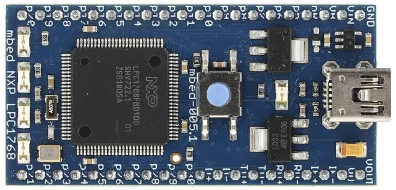
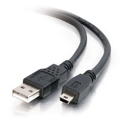
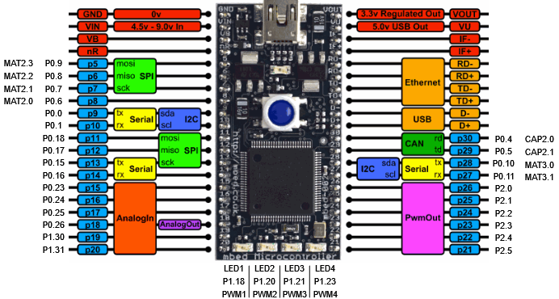

= Experiment 1: Development Platform
Ahmad Khayyat; Hazem Selmi; Saleh AlSaleh
212, 11 January 2022

== Objectives

- Get familiar with the development platform:
+
[horizontal]
Hardware:: microcontroller, development board, peripherals
Software:: IDE, compiler, debugging, programming

- General-purpose input/output (GPIO): digital output

- Introduce CMSIS: Cortex Microcontroller Software Interface Standard

== Parts List

- LPC1768 mbed board
+

- USB A-Type to Mini-B cable
+

== Background

=== Microcontroller

LPC1768 is a microcontroller manufactured by NXP. LPC1768 is only one member of
a big family of microcontolles. NXP was founded by
Philips as Philips Semiconductors, and renamed NXP in 2006. A major
difference between a microcontroller and a microprocessor is that the
former has some additional built-in devices, such as memory, I/O
peripherals, and timers.

The LPC1768 microcontroller is an ARM 32-bit Cortex-M3
microcontroller. Some of its features include: CPU clock up to 120MHz,
512kB on-chip Flash ROM, 64kB RAM, Ethernet 10/100 MAC, USB 2.0
full-speed Device controller and Host controller, four UARTs, general
purpose I/O pins, 12-bit ADC, 10-bit DAC, four 32-bit timers, Real
Time Clock, System Tick Timer.

The product data sheet for the LPC1768 microcontroller <<lpc1768-data-sheet>>
and the more detailed user munual <<lpc1768-manual>> are
essential resources for any developer.

=== Development Board

The LPC1768 microcontroller chip is used to build the _LPC1768
mbed board_, which we will be using in this LAB.

The LPCXpresso board consists of two parts:

. LPCXpresso target board, which hosts the LPC1768 microcontroller
. LPC-Link: a debug probe for debugging and the target
  microcontroller.

=== Compilation Methods

There are two main ways to compile C/C++ code for LPC1768:

. Using mbed online compiler where you only need a web browser to compile the source code and download the binary. Then, you need to copy the binary file to the mbed drive.
In order to use mbed online compiler, you need to create an account at https://os.mbed.com/ide/[mbed online compiler].

. Using MCUXpresso IDE which allows a wide range of advanced debugging features. The MCUXpresso IDE will build/compile the project and transfer the compiled binary to the development board. Then, it will start execution of the `main` function.

[IMPORTANT]
=================================================
In order to use MCUXpresso IDE with LPC1768, the LPC1768 must have firemware version equal to or greater than `141212`. The firmware version is stored in the `MBED.htm` file in the LPC1768, use a text editor to open the `MBED.htm` file. Please refere to https://os.mbed.com/handbook/Firmware-LPC1768-LPC11U24[LPC1768_Firmware] to download and upgrade the firmware of the LPC1768.
=================================================

MCUXpresso IDE will be used for the lab manual, but feel free to use mbed online compiler.

=== MCUXpresso IDE

The MCUXpresso IDE is an https://www.eclipse.org/[Eclipse]-based
software development environment for NXP's LPC microcontrollers.

The MCUXpresso IDE uses the GNU toolchain (compiler and linker), and
offers the choice of two C libraries:

- Redlib (default): a proprietary ISO C90 standard C library, with
  some C99 extensions. Often results in smaller binary size.
- https://sourceware.org/newlib/[Newlib]: an open source complete C99 and C++ library.

==== Installation

To install your copy of the MCUXpresso IDE:

. Using a web browser, navigate to the
https://www.nxp.com/design/software/development-software/mcuxpresso-software-and-tools-/mcuxpresso-integrated-development-environment-ide:MCUXpresso-IDE[MCUXpresso Integrated Development Environment (IDE)] page.

. Use the _Download_ button to go to the download page, then use the download
link that matches your operating system.
+
NOTE: You may need to create an account to access the download page.

. Run the downloaded installer.

=== Input/Output Ports

The LPC1768 microcontroller has five input/output (I/O) ports. Each
port is 32 bits. However, not all of them are available for the
developer. For example, pins 12, 13, 14, and 31 of port 0 are not
available.

Each of the I/O pins can be referred to using the port number and the pin
number. For example, `P0.17` or `P0[17]` is pin 17 in port 0, and `P1.22` or
`P1[22]` is pin 22 in port 1.

Most of the I/O pins have multiple functions. For example: `P0.10` can
perform one of these jobs:

[horizontal]
P0[10]  :: General purpose digital input/output pin.
TXD2    :: Transmitter output for UART2.
SDA2    :: I2C2 data input/output.
MAT3[0] :: Match output for Timer 3, channel 0.

NOTE: Don't worry if you don't understand these functions, you will
learn about them throughout the course.

A command is needed to choose which function is to be used in a
specific pin. The only exception is the first function (GPIO) because
it is the default function.

NOTE: Relying on a default value may be acceptable in simple
programs. However, a good programming style when you have many
functions and interrupts is not to assume any default value as they
may have been changed somewhere in your program. Instead, you should
explicitly specify any desired values.

==== Pin Layout

The pin layout of the LPC1768 mbed board is shown in the
<<lpc1768-pin-layout>> figure below.

[[lpc1768-pin-layout]]
.LPC1768 pin layout

==== Memory-Mapped I/O

ARM uses memory-mapped I/O. When using memory-mapped I/O, the same
address space is shared by memory and I/O devices. Some addresses
represent memory locations, while others represent registers in I/O
devices. No separate I/O instructions are needed in a CPU that uses
memory-mapped I/O. Instead, we can use any instruction that can
reference memory to move values to or from memory-mapped device
registers.

==== General-Purpose Input/Output (GPIO)

GPIO is available in most I/O pins. A GPIO pin is a pin that can be
used for digital input or digital output. You need to choose the
direction of the pin (whether it is used for input or output). In the
first example of this experiment, we will set the direction to be
output. To use a digital output pin, you need to be able to to _set_
the output to HIGH (1), and to _clear_ it to LOW (0).

In summery, we need to learn about 3 registers for our first
experiment:

. The register that controls the _direction_ of GPIO pins
. How to _set_ a pin to HIGH.
. How to _clear_ a pin to LOW.

==== Accessing Registers

Each I/O register has an address. For example:

. The address of the register that controls the direction of port 0
  pins is: `0x2009c000`.

. The address of the register that _sets_ port 0 pins to HIGH is:
  `0x2009c018`.

. The address of the register that _clears_ port 0 pins to LOW is:
  `0x2009c01c`.

To access a register more easily, you can give it a name.
One way to give a register a name in the C programming language is to use
_pointers_, _pointer dereferencing_, and the `define` directive.

NOTE: For more details about these features (and more) of the _C programming
language_, it is strongly recommended to consult the document <<c-data-structures,Data
Structures in C>>.

.Giving Registers Names
==================================================
Here are examples showing how to assign names to registers:

[source,c]
--------------------------------------------------
// GPIO Port 0
#define DIR_P0  (*((volatile unsigned long *) 0x2009c000))
#define SET_P0  (*((volatile unsigned long *) 0x2009c018))
#define CLR_P0  (*((volatile unsigned long *) 0x2009c01c))
// GPIO Port 1
#define DIR_P1  (*((volatile unsigned long *) 0x2009c020))
#define SET_P1  (*((volatile unsigned long *) 0x2009c038))
#define CLR_P1  (*((volatile unsigned long *) 0x2009c03c))
--------------------------------------------------
==================================================

.Setting Pin Direction
==================================================
To set the direction for pins 1, 2, 3 and 4 of port 0 as output, while setting
the direction of the remaining pins as input:

[source,c]
--------------------------------------------------
DIR_P0 = 0x0000001E;
// OR
DIR_P0 = 30;

// Make sure that you understand that these statements are equivalent!
--------------------------------------------------
==================================================

TIP: The first task is to blink an LED using the above registers!

TIP: In the first experiment, you can avoid making any external connections by
using the one of on board LEDs, which is connected to `P1.18`.

=== CMSIS

[quote, ARM Ltd., CMSIS: Introduction]
__________________________________________________
The _Cortex Microcontroller Software Interface Standard_ (CMSIS) is a
vendor-independent hardware abstraction layer for the Cortex-M
processor series [...]. The CMSIS enables consistent device support
and simple software interfaces to the processor and the peripherals,
simplifying software re-use [...].
__________________________________________________

The CMSIS components are: CMSIS-CORE, CMSIS-Driver, CMSIS-DSP,
CMSIS-RTOS API, CMSIS-Pack, CMSIS-SVD, CMSIS-DAP, CMSIS-DAP/
// <<cmsis-intro>>.

The most relevant component to us is CMSIS-CORE.
//  <<cmsis-core>>.

[quote, ARM Ltd., CMSIS-CORE: Overview]
__________________________________________________
CMSIS-CORE implements the basic run-time system for a Cortex-M device
and gives the user access to the processor core and the device
peripherals. In detail it defines:

- *Hardware Abstraction Layer (HAL)* for Cortex-M processor registers
  with standardized definitions for the SysTick, NVIC, System Control
  Block registers, MPU registers, FPU registers, and core access
  functions.

- *System exception names* to interface to system exceptions without
  having compatibility issues.

- *Methods to organize header files* that makes it easy to learn new
  Cortex-M microcontroller products and improve software
  portability. This includes naming conventions for device-specific
  interrupts.

- *Methods for system initialization* to be used by each MCU
  vendor. For example, the standardized `SystemInit()` function is
  essential for configuring the clock system of the device.

- *Intrinsic functions* used to generate CPU instructions that are not
  supported by standard C functions.

- A variable to determine the *system clock frequency* which
  simplifies the setup the SysTick timer.
__________________________________________________

CMSIS provides abstraction at the chip level only. Other libraries
provide more extensive APIs for additional peripherals and board
features, but are usually less generic and more vendor-specific.
// <<lpcx-cmsis>>.

=== Accessing Registers Using CMSIS

When using CMSIS, you don't need to know register addresses, which
implies that you don't need to use the `#define` directive to name the
registers. Instead, you use the `#include` directive to include the
`lpc17xx.h` header file, which contains all the register address
definitions for the LPC17xx family of microcontrollers. When you use
the LPCXpresso IDE to create a CMSIS project, the IDE generates a
basic source file which already includes this header file.

NOTE: In the `lpc17xx.h` header file, the names are not given using the
`#define` directive only. They are given using `#define` (for the base address)
then using structures to group similar (and adjecent) registers.

==== Structures and Pointers

The CMSIS header file, `lpc17xx.h`, organizes the registers into
logical groups based on their functions, using C structures. First, a
structure is defined by listing its fields. Then, a pointer is defined
for each needed instance of that structure, pointing to the starting
address of the instance, as documented in the microcontroller manual.

For example, the names of the pointers to the structure instances for
the five GPIO ports are:

[horizontal]
`LPC_GPIO0`:: for port 0
`LPC_GPIO1`:: for port 1
`LPC_GPIO2`:: for port 2
`LPC_GPIO3`:: for port 3
`LPC_GPIO4`:: for port 4

These pointers are defined in the `lpc17xx.h` file as follows:

[source,c]
--------------------------------------------------
#define LPC_GPIO0  ((LPC_GPIO_TypeDef *)  LPC_GPIO0_BASE)
#define LPC_GPIO1  ((LPC_GPIO_TypeDef *)  LPC_GPIO1_BASE)
#define LPC_GPIO2  ((LPC_GPIO_TypeDef *)  LPC_GPIO2_BASE)
#define LPC_GPIO3  ((LPC_GPIO_TypeDef *)  LPC_GPIO3_BASE)
#define LPC_GPIO4  ((LPC_GPIO_TypeDef *)  LPC_GPIO4_BASE)
--------------------------------------------------

where `LPC_GPIO_TypeDef` is the name of the structure, which is defined
earlier in the file to describe the registers related to GPIO ports,
and `LPC_GPIO0_BASE` through `LPC_GPIO4_BASE` are fixed addresses,
also defined earlier in the header file, at which the registers for
each port start. Other structures are also defined for registers
related to functions other than GPIO.

==== Fields are Registers

For each instance of a structure, such as `LPC_GPIO0`, you can access
a register by accessing the corresponding field in that structure
instance. For example, the three registers used in Experiment 1 are
defined in the aforementioned `LPC_GPIO_TypeDef` structure as the
following fields:

. `FIODIR`
. `FIOSET`
. `FIOCLR`

Each of these registers is accessible within the structure instance of
each port.

[IMPORTANT]
==================================================
Therefore, when using CMSIS, you need to know two names to access a
register:

. The name of the pointer to the structure instance.

. The name of the field within the structure, corresponding to the
  desired register.
==================================================

.Setting Pin Directions and Values
==================================================
- To set the direction of pins 3,4, 5, and 6 in port 2 as output (and set the
  remaining pins as input):
+
[source,c]
--------------------------------------------------
LPC_GPIO2->FIODIR = 0x00000078;
--------------------------------------------------

- To set pins 3 and 7 in port 1 while keeping the rest of the pins unchanged, use:
+
[source,c]
--------------------------------------------------
LPC_GPIO1->FIOSET = 0x00000088;
--------------------------------------------------
==================================================

NOTE: Again, to learn more about structures and pointers in the _C programming
language_, refer to the <<c-data-structures,Data Structures in C>> document.

===  LEDs

- What is an LED?

- How does an LED work?

- What is the maximum voltage that an LED can tolerate?

- If the output voltage is higher than the LED maximum voltage, what
  should you do?

TIP: An LED should be connected to an output GPIO pin.

.GPIO, Revisited

The GPIO mode is available in all I/O pins. A GPIO pin is one that can
be used as a digital input or digital output. Obviously, you need to
choose the direction of the pin to determine whether it is going to be
used as input or output. In this experiment, we will choose the
direction to make the required pin work as GPO (General-Purpose
Output). In this case (GPO), you need a command to set this output pin
to HIGH (1), and a command to Clear it to LOW (0).

TIP: A `0` in a _SET_ or a _CLR_ register has no effect on the port pins!

TIP: A basic way to add _delay_ is to use a `for` loop, e.g.:
`for(i=0;i<500000,i++);`. You will learn about more sophisticated and accurate
ways in later experiments.

== Tasks

[[create-project]]
=== Create a Non-CMSIS Project

. Click _Quickstart Panel_ > _New project..._.

. Choose _LPC13 / LPC15 / LPC17 / LPC18_ > _LPC175x_6x_ > _C Project_.

. Choose a project name, e.g. `blinky`.

. In the _Target selection_ dialog, choose _LPC1700_ > _LPC1768_.

. In the _CMSIS Library Project Selection_ dialog, set _CMSIS Core
  library to link project to_ to `None`.

. In the _CMSIS DSP Library Project Selection_ dialog, set _CMSIS DSP
  Library to link project to_ to `None`.

. Uncheck _Enable linker support for CRP_, then click _Finish_.

. Open the main source file named after the project, and write your
  `main` function.

[[blink-LED]]
=== Blink an LED without CMSIS

. Figure out which pin is connected to the LED.
+
TIP: Refer to the LPC1768 board documentation.

. Give the required registers some friendly names using the `#define`
  directive.

. In an infinite loop inside the `main` function:

.. Set the pin to act as output by setting the correct bit in the
   direction register to `1`.

.. Set the output pin to `1`.

.. Clear the output pin (set to `0`).

.. Insert a delay loop after both set and clear, to be able to see the
   LED blink.

. Which value of the pin turns the LED on, and which value turns it
  off? and why?

=== Import the CMSIS Libraries

. Click _Quickstart Panel_ > _Import project(s)_

. In the _Project archive (zip)_ dialog, click _Browse_ next to the
  _Archive_ field, and choose:
+
..................................................
C:\nxp\MCUXpressoIDE_<version>\ide\Examples\Legacy\CMSIS_CORE\CMSIS_CORE_Latest.zip
..................................................

. Keep only these two projects selected: `CMSIS_CORE_LPC17xx` and
  `CMSIS_DSPLIB_CM3`, and click _Finish_.

=== Create a CMSIS Project

To create a project that uses CMSIS, follow the same instructions for
<<create-project,creating a non-CMSIS project>> up to the _CMSIS
Library Project Selection_ dialog. Instead of `None`, select
`CMSIS_CORE_LPC17xx`.

=== Blink an LED Using CMSIS

Using a CMSIS project, rewrite your LED blinking program to use CMSIS
facilities.

=== Debug Your Project

. Click _Quickstart Panel_ > _Build 'cmsis_blinky' [Debug]_ to build
  the project.

. Connect the LPC1768 board to the PC using the USB cable.

. Click _Quickstart Panel_ > _Debug 'cmsis_blinky' [Debug]_ to debug
  the project interactively on the target board.
+
[TIP]
.Running the Debugger
==================================================
You can run the debugger using any of the following three ways:

. In the _Quickstart Panel_ at the lower left corner, click _Debug
  '<project-name>' [Debug]_.

. In the main menu, choose _Run_ > _Debug As_ > _C/C++ (NXP
  Semiconductors) MCU Application_.

. In the toolbar, click on the debug button .
==================================================

[NOTE]
==================================================
You may need to download and install https://os.mbed.com/handbook/Windows-serial-configuration[mbedWinSerial] application if you cannot find the target board.
==================================================

. Once the debugger starts, it will pause execution at the first
  statement in the progrm. Resume execution by hitting the `F8` key,
  or using the resume button in the toolbar
  .

== Grading Sheet

[cols="5,1",options="header"]
|==================================================
| Task | Points

| Blink an LED without CMSIS | 4
| Blink an LED using CMSIS | 4
| Debug your project | 2

|==================================================

[bibliography]
== Resources

* [[[lpc1768-data-sheet]]] 
+ 
NXP Semiconductors. _LPC1769/68/67/66/65/64/63 --
  Product data sheet_. Rev. 9.10. 8 September 2020. +
  https://www.nxp.com/docs/en/data-sheet/LPC1769_68_67_66_65_64_63.pdf

* [[[lpc1768-manual]]] 
+ 
NXP Semiconductors. _UM10360 -- LPC176x/5x User
  Manual_. Rev. 3.1. 4 April 2014. +
  https://www.waveshare.com/w/upload/0/07/LPC176x5x_User_manual_EN.pdf  

* [[[lpc1768-schematic]]]
+
Embedded Artists AB. _Board Schematics for current LPC1768
  board -- LPCXpresso LPC1768 25 July 2011. +
  https://os.mbed.com/media/uploads/chris/lpc1768-refdesign-schematic.pdf

* [[[c-data-structures]]] 
+
Data Structures in C. +
http://www.ccse.kfupm.edu.sa/~salehs/courses/212-coe306/html/data-structures-in-c.html

