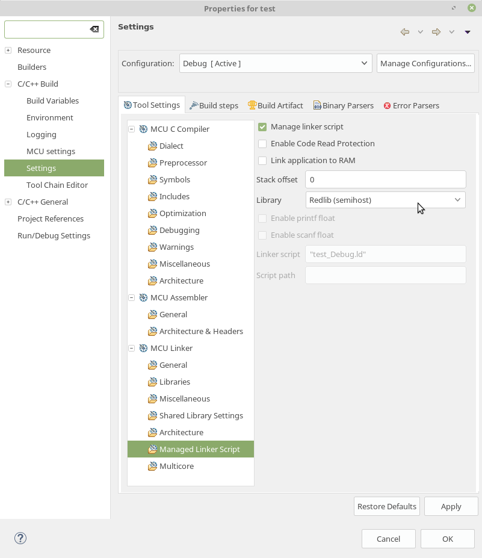

= Experiment 2: General-Purpose Input/Output (GPIO)
Ahmad Khayyat; Hazem Selmi; Saleh AlSaleh
212, 11 January 2022

== Objectives

- Using GPIO pins as input and output
- Interfacing with external LEDs, switches, and push-buttons
- Bit manipulation in C

== Parts List

- LPC1768 mbed board
- USB A-Type to Mini-B cable
- Breadboard
- LEDs
- 330-Ohm Resistors
- Jumper wires

== Background

=== Bit Manipulation in C

The core of embedded system programming is setting (or clearing)
specific bits in different registers inside the microcontroller. This
highlights the importance of _bit manipulation_ as a programming
skill.

Most modern architectures are byte-addressable: the smallest unit of
data is the byte. Nonetheless, it is possible to operate on individual
bits by clever use of bitwise operators.

==== Bitwise Operators

Bitwise operators apply to each bit of their operands.

[cols="^1,1,2l",options="header",width="70%"]
|==================================================
| Operator  | Function  | Examples

| `&`       | Bitwise AND
|
0011 & 0101 = 0001
   3 &    5 =    1

| `\|`      | Bitwise OR
|
0011 \| 0101 = 0111
   3 \|    5 =    7

| `^`       | Bitwise XOR
|
0011 ^ 0101 = 0110
   3 ^    5 =    6

| `~`       | Bitwise NOT
|
~00110101 = 11001010

| `<<`      | Shift left
|
3 << 2 = 12

| `>>`      | Shift right
|
8 >> 2 = 2

|==================================================

NOTE: In C, numbers can be written in decimal, octal, or hexadecimal,
but not in binary, e.g. `16 = 020 = 0x10`.

WARNING: Right-shifting in C is implementation-specific. Often,
_logical shifting_ is applied to unsigned values, whereas _arithmetic
shifting_ is applied to signed values.

==== Masking

A simple assignment to a 32-bit register or memory location will
overwrite all 32 bits. However, manipulating specific bits implies
that the remaining bits in the register remain intact. An essential
technique to achieve that is bit masking.

A mask is a value that can be used in a binary, i.e. two-operand,
bitwise operation to change specific bits of some other value. Masking
relies on the following rules of Boolean Algebra:

- ANDing a bit with a `0` results in a `0`. ANDing a bit with a `1`
  results in the same bit.

- ORing a bit with a `0` results in the same bit. ORing a bit with a
  `1` results in a `1`.

- XORing a bit with a `0` results in the same value. XORing a bit with
  a `1` inverts the bit.

.Exercises
**************************************************
. What mask and bitwise operation are required to set the third least
  significant bit (bit 2) to `1` without affecting the other bits in a
  32-bit variable `x`?

. What mask and bitwise operation are required to reset bit 10 of a
  16-bit variable `y` to `0`?

. What mask and bitwise operation are required to toggle bit 20 of a
  32-bit variable `z`?
**************************************************

==== Creating Masks by Shifting

If you have worked out the exercises above, you would have noticed
that spelling out masks can be tedious, verbose, and error-prone. One
trick that makes it easier to create masks is to use the shift
operations. For example, to create a mask whose bit 10 is `1` and
whose other bits are `0`, you can use the following C statement:

[source,c]
-------------------
mask = 1 << 10;
-------------------

.Exercise
**************************************************
Repeat the three exercises above by using shift operations to create
the masks.
**************************************************

=== Digital Input

A GPIO pins can be configured to act as a general-purpose input pin by
setting the corresponding bit in the `FIODIR` register to `0`. A
digital input pin is _digital_ because it is _driven_ by an external
digital device that has only two states (HIGH or LOW); and it is
_input_ because its state is _read_ by the microcontroller. That
implies that some external device/circuit is needed to generate that
digital input value (HIGH or LOW).

Examples for simple digital input devices include switches and
push-buttons.

CAUTION: A common mistake is to forget about or misuse the `FIODIR`
register.

==== The `FIOPIN` Register

In addition to the three registers used in Experiment 1 (`FIODIR`,
`FIOSET`, and `FIOCLR`), there are a few additional GPIO-related
registers. The one that is particularly essential for reading from a
digital input peripheral is `FIOPIN`.

This register is a R/W register that stores the current state of a
port's pins. In other words, you can write to `FIOPIN` to set and
clear pins of a specific port. You can also read the state of port
pins. `FIOPEN` is essential for the read operation, but since it is a
R/W register, it can also be used with output pins. For instance, you
can redo Experiment 1 using `FIOPIN` only instead of `FIOSET` and
`FIOCLR`.

There is an `FIOPIN` register for each one of the five I/O ports, and
it can be accessed in the same way `FIOSET` and `FIOCLR` are. For
example, port 1's `FIOPIN` register can be accessed using:

[source,c]
--------------------------------------------------
LPC_GPIO1->FIOPIN
--------------------------------------------------

.Using the `FIOPIN` Register
==================================================
To set the third bit of port 0, i.e. `P0[2]`:

[source, c]
--------------------------------------------------
LPC_GPIO0->FIODIR |= (1 << 2);  // configure the pin for output
LPC_GPIO0->FIOPIN |= (1 << 2);  // set the the pin value to high or one
LPC_GPIO0->FIOPIN &= ~(1 << 2); // clear the pin value, set its value to be low or zero
--------------------------------------------------
==================================================

=== Debugging

The MCUXpresso IDE along with LPC-Link hardware provide the ability to step
through the code by executing one statement or instruction at a time. This helps
find which line in the code causes some errors or invalid values.

To step through the program statements or instructions, run it by pressing `F6`
instead of `F8`. This will execute the code one statement at a time.

NOTE: You can add a breakpoint to a statement and the debugger will stop at that
statement only.

[TIP]
==================================================
You can learn more about MCUXpresso's debugging support by referring to the
<<mcuxpresso-ide-user-guide>>.

In particular, you may want to check out section _3.4.2 Controlling Execution_,
which lists all the possible ways to step through your code, such as stepping
into and stepping over functions.
==================================================

==== Inspect Variable Values at Runtime

After uploading a program to the microcontroller, start debugging it by stepping
through the statements or by adding a breakpoint. Now, you can get the value of
any variable simply by hovering the mouse over the variable in the code. A
window will be shown containing details about the variables such as type and
value.

NOTE: This can also be used for registers. For example, you can use it to find
the value of `LPC_GPIO0 -> FIOPIN`.

==== Print Variable Values

To be able to use the `printf` function to print variables to the console:

. Right Click on the project's name and then click on _Properties_.
. Expand _C/C++ Build_ and select _Settings_.
. Under _MCU Linker_, click on _Managed Linker Script_.
. Change the _Library_ used from _Redlib (none)_ to _Redlib (semihost)_, as
  shown in the <<semihost>> figure.

NOTE: This is a limited implementation of the `printf` function that does not
recognize all format specifiers, but is sufficient for most debugging needs.

.Using the `printf` Function
==================================================
[source, c]
---------------------------------------------------
printf("push-button value: %d\n", value);
// Given that value is an integer (int) containing the state of a push button
---------------------------------------------------
==================================================

[[semihost]]
.Semihost Debugging Configuration

== Tasks

In this experiments, you will control LED lights by software.

=== Hardware

. Find out which I/O Pins you _can_ use for controlling LEDs, and choose
  specific ones.

. Connect  four LEDs using a proper current-limiting resistor.

. Connect  two switches using a proper current-limiting resistor.

=== Software

==== Blink an LED using `FIOSET` and `FIOCLR`

Pick an LED and blink it using _only one `FIOPIN` statement_ and _one
delay loop!_

TIP: Use bitwise exclusive-OR.

==== Implement LED Scrolling

. Write a program that makes it look like the light is scrolling
  through 4 LEDs that are connected externally. The scroll effect can
  be achieved by turning LEDs ON and OFF sequentially.

. Use two switches to control the scrolling. For example, you can use
  one switch to turn the scrolling ON and OFF, and the second switch
  to reverse the scroll direction.

== Grading Sheet

[cols="5,1",options="header"]
|==================================================
| Task | Points

| Using FIOPIN with XOR | 4
| Using FIOPIN with input pins | 4
| Discussion | 2
|==================================================

[bibliography]
== Resources
* [[[mcuxpresso-ide-user-guide]]]
+
MCUXpresso IDE User Guide
  Guide_. Rev. 11.4.1. 15 September 2021. +
  https://www.nxp.com/docs/en/user-guide/MCUXpresso_IDE_User_Guide.pdf

