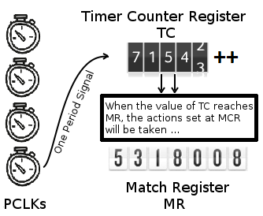
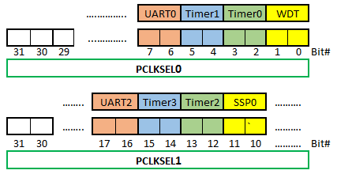

= Experiment 4: Hardware Timers
Hazem Selmi; Ahmad Khayyat; Mansour Alharthi; Saleh AlSaleh
212, 30 December 2021

== Objectives

- Using hardware timers

- Using the <<lpc1768-manual,LPC176x manual>> to figure out how to use
  a given register

- Identifying how to access a given register by referring to the
  `LPC17xx.h` file

== Parts List

- LPC1768 mbed board
- USB A-Type to Mini-B cable
- Breadboard
- LEDs
- 330-Ohm Resistors
- Jumper wires

== Background

There are four hardware timers in LPC1768: Timer 0, Timer 1, Timer 2, and Timer
3. They are identical and can work independently with different settings.

Throughout this document, _timer_ or `TIMERx` refer to one of these LPC1768
timers. Every one of the timer-related registers discussed henceforth applies to
all of these four timers, and cannot be used without specifying the targeted
timer.

=== Timer Basic Operation: Timer Counter

The basic function of any timer is to have a counter running. In LPC1768, this
counter is called _Timer Counter_ (`TC`).

In this section, we will learn how to enable `TC` to start ticking, and will
find out how fast it can run.

==== Controlling the Counting Speed

Peripherals in LPC1768 are fed with an input clock called the peripheral clock
(`PCLK`). By default, the _Timer Counter_ (`TC`) register is incremented every
`PCLK` cycle.

There are two ways to change that:

. Divide `PCLK` by a factor other than the default. This will change the
  input clock frequency. Since this method is applicable for all peripherals we
  will discuss it in a separate section at the end of this document.

. Using an intermediate counter called the _prescale counter_.

The _prescale counter_ is _always_ incremented every `PCLK` pulse. This continues
till the _prescale counter_ = the _prescale register_. When that happens, two
events take place in the next `PCLK` pulse:

- Increment `TC` by 1
- Reset the _prescale counter_ and continue counting

If the _prescale register_ is not set to any value (the default is 0), `TC` to
be incremented every `PCLK`.

[NOTE]
==================================================
Although it was claimed ealier that `TC` is by default incremented every `PCLK`,
you now know that this is only true when the _prescale register_ = 0.
==================================================

.`TC` and the _Prescale Register_
==================================================
If you set the _prescale register_ to 5, `TC` will be incremented every 6 `PCLK`
pulses.
==================================================

==== Enabling the Counter

To start using a timer, you first must enable counting! In LPC1768, the
_Timer Control Register_ (`TCR`) is the register that allows you to do that.

[NOTE]
==================================================
As should be clear from previous experiments, you interact with peripherals
through registers. In the case of timers, to enable a counter and have it start
counting, you need to write to the `TCR` register. To do that, you must:

. Identify the relevant bit(s) of the register. For that, refer to table 428 in
  chapter 21 of the LPC1768 manual.

. Find out how to access this register using CMSIS. One easy way to do that is
  to check the `lpc17xx.h` file to find the structure containing the `TCR`
  field.
==================================================

.Exercise
**************************************************
- How can you enable Timer 0 counter?
- How can you enable Timer 3 counter?
**************************************************

[TIP]
==================================================
You can write a single line of code that would enable the counter, and then use
`printf()` to see whether `TC` is counting.
==================================================

=== Timer Counter (`TC`) is Ticking; Now What?

There are two main ways to use a ticking timer:

. Load a _match register_ (`MR`) with some value and then wait till `TC`=`MR` to
  trigger some action.
. Capture the time in a _capture register_ (`CR`), i.e. set `CR`= `TC`, whenever
  an event takes place on a given pin. The event is simply any change of the pin
  state (HIGH -> LOW or LOW -> HIGH, i.e. a positive edge or a negative edge).

In this section, we will discuss these two options.

==== Timing Using a Match Register

For each LPC1768 timer, there are four match registers: `MR0`, `MR1`, `MR2`, and
`MR3`.

[NOTE]
.Timer Registers
==================================================
Hereafter, `MR` or `MRx` refers to one of `MR0`, `MR1`, `MR2`, and `MR3` _match
registers_ of a specific LPC1768 timer.
==================================================

When the value of `TC` reaches the value in the _match register_ (`MR`), an
action is triggered. Therefore, setting `MR` specifies the timer's period. The
action triggered every time `TC` reaches `MR0` can be set using the _Match
Control Register_ (`MCR`) to one (or more) of the following:

. Generate an interrupt
. Reset `TC`
. Stop `TC`

.Timers in LPC1768

You can enable or disable the above actions by setting or clearing the
three least significant bits of the `MCR` register.

.Setting Timer Actions Using the `MCR` Register
[cols="^1,3,3",options="header",width="70%"]
|==================================================
| `MCR` bit | Bit value = 1          | Bit value = 0

| 0          | Enable timer interrupt  | Disable timer interrupt
| 1          | Reset `TC`              | Disable this feature
| 2          | Stop `TC`               | Disable this feature
|==================================================

===== External Match Action

You can also trigger a different action when `TC`=`MRx`, which is, to _set_,
_reset_, or _toggle_ a specific bit. This bit can be pinned out to an external
output pin, hence the name: _External Match_ bit (`EMx`).

For each timer, there are 4 `EM` bits, namely `EM0`, `EM1`, `EM2`, and
`EM3`. Each `EMx` bit can be controlled when `TC` equals the corresponding
`MRx`. These four `EM` bits belong to the `EMR` register. In other words, for
each `MRx`, the external match _control bits_ and the _controllable_ bit are all
part of the same `EMR` register.

[TIP]
==================================================
Study the `EMR` register tables (432 and 433) in chapter 21 of the LPC1768
manual to understand the following examples.
==================================================

.External Match Actions
==================================================
- Assigning `0` to bit 6, and `1` to bit 7 in `EMR` will force bit 1 in `EMR`
  to be HIGH when `TC` = `MR1`.
- Assigning `1` to both bits 10 and 11 in `EMR` will toggle bit 3 in `EMR` when
  `TC` = `MR3`.
==================================================

Theoretically, any `EM` bit can be pinned out to a pin that is named `MATx.y`,
where `x` is the timer number and `y` is the match register number.

.Pinned Out External Match Actions
==================================================
- When using `MR3` with Timer 2, the `EM3` bit of the `EMR` register of Timer 2
  can be pinned out to `MAT2.3`.
- When using `MR1` with Timer 0, the `EM1` bit of the `EMR` register of Timer 0
  can be pinned out to `MAT0.1`.
==================================================

Practically, however, only `MATx.0` and `MATx.1` are available in LPC1768 for
Timer 0, Timer 1, and Timer 3, whereas Timer 2 can use all four `MAT2.y` pins.

[NOTE]
==================================================
You need to change a pin's function to use it as `MATx.y`. Refer to the `PINSEL`
section in experiment 3 and chapter 8 of the LPC1768 manual for more details.
==================================================

.Exercise
**************************************************
One of the tasks in this experiment is about external match actions. To be able
to complete that task, you need to find a suitable `MATx.y` pin.

So, refer to chapter 8 of the LPC1768 manual and list all the `MATx.y` pins and
find out which of them is physically available and accessible on your MCUXpresso
board.
**************************************************

==== Capturing an Event (Event Timers)

Instead of using a _match register_, you can capture the time in a _capture
register_ (`CR`) when a pin's state changes. In other words, you can take a
snapshot of the timer value when an input signal changes.

This happens by loading the `TC` value into a `CR` (`CR` <= `TC`) when an input
pin has a positive edge and/or a negative edge.

For each timer, there are two _capture registers_: `CR0` and `CR1`. A pin that
can be used with a `CR` is named `CAPx.y`, where `x` is the timer number and `y`
is _capture register_ number.

.Capture Registers
==================================================
- By using `CAP1.0`, you will be loading `TC` into `CR0` of Timer 1.
- By using `CAP0.1`, you will be loading `TC` into `CR1` of Timer 0.
==================================================

To enable this feature, you need to use the `CCR` register. In addition to
capturing the time, you can use the `CCR` register to enable generating an
interrupt when the state of `CAPx.y` changes.

[TIP]
==================================================
Study the `CCR` register table (431) in chapter 21 of the LPC1768 manual to
understand the following examples.
==================================================

.Using the `CCR` Register
==================================================
Assign 15 (1111 in binary) to the `CCR` register of Timer 0 will:

- Load `TC` to `CR0` on both the positive and negative edges of `CAP0.0`
- Generate a Timer 0 interrupt request
- Load `TC` to `CR1` only on the positive edges of `CAP0.0`, without generating
  interrupt requests.
==================================================

[NOTE]
==================================================
You need to change a pin's function to use it as `CAPx.y`. Refer to the `PINSEL`
section in experiment 3 and chapter 8 of the LPC1768 manual for more details.
==================================================

.Exercise
**************************************************
One of the tasks in this experiment is about capturing event times. To be able
to complete that task, you need to find a suitable `CAPx.y` pin.

So, refer to chapter 8 of the LPC1768 manual and list all the `CAPx.y` pins and
find out which of them is physically available and accessible on your MCUXpresso
board.
**************************************************

=== Important Notes

- If you choose to enable the timer interrupt, remember to enable the the NVIC
  and to clear the interrupt bit in the ISR. To clear the `MR0` interrupt flag,
  set the least significant bit in the _Interrupt Register_ (`IR`).

- A common misconception is to assume that register `MR0` can be used with timer
  0 only, register `MR1` with timer 1 only, and so on. Each timer has its own 4
  match registers.

- As usual, all the registers in this experiment are fields of some
  structures. Refer to the `LPC17xx.h` header file to find the required name and
  field to access the required register.

[[blink-led]]
.Exercise
**************************************************
In this exercise, we will use a hardware timer and timer interrupts to
blink an LED.

[source,C]
----------
// "x" is a placeholder. Replace x with an appropriate value.

int main(void) {

    // Try to find out the IRQ number. Why is this step important?
    NVIC_EnableIRQ(x);
    // Answer:

    // What does register TCR do?
    LPC_TIMx->TCR |= x;
    // Answer:

    // What does register MRx do?
    LPC_TIMx->MRx = x;
    // Answer:

    // What does register MCR do?
    LPC_TIMx->MCR = x;
    // Answer:

    LPC_GPIOx->FIODIR = 1 << x ;

    // Can we remove this while loop? Why?
    while(1);
    // Answer:

    return 0 ;
}

// When will the following function be executed? Who is going to call it?
// Answer:

void TIMERx_IRQHandler() {

    LPC_GPIOx->FIOPIN ?? (1 << x);
    // Replace "??" with the appropriate operator

    // What does register IR do?
    LPC_TIMx->IR |= (1 << x);

}
----------

**************************************************

=== Peripheral Clock (`PCLK`)

Timers, among other devices, rely on _peripheral clocks_ (`PCLK`),
which in turn are derived from the _core clock_ (`CCLK`).

There are four possible frequency configurations for the peripheral
clock (`PCLK`), which are set using a pair of bits.

.Peripheral Clock (`PCLK`) Frequency Configurations
[cols="^1,2",options="header",width="60%"]
|==================================================
| Bit Values | Frequency Configuration

| `01` | `PCLK` = `CCLK`
| `10` | `PCLK` = `CCLK` / 2
| `00` | `PCLK` = `CCLK` / 4
| `11` | `PCLK` = `CCLK` / 8
|==================================================

These pairs of bits belong to the `PCLKSEL0` and `PCLKSEL1` registers,
which control the `PCLK` frequency for all peripherals.

The <<PCLKSELx_registers,`PCLKSEL0` and `PCLKSEL1` Register Fields
figure>> illustrates some of the fields of the `PCLKSEL0` and
`PCLKSEL1` registers. Every two bits control the `PCLK` frequency for
a specific peripheral.

[[PCLKSELx_registers]]
.`PCLKSEL0` and `PCLKSEL1` Register Fields

.Question
**************************************************
Can you ignore this step? What would happen if we skip it?
**************************************************

[NOTE]
==================================================
For the full list of peripherals and their corresponding two bits in
`PCLKSEL0` or `PCLKSEL1`, you can refer to Chapter 4 (section 4.7.3)
in the <<lpc1768-manual,LPC176x manual>>.
==================================================

[NOTE]
==================================================
This section is not specific to timers. It is about configuring the
frequency of `PCLK`, which is required for timers.
==================================================

[NOTE]
==================================================
You may want to refer back to this section whenever you want to use a
peripheral that requires `PCLK`.
==================================================

=== Power Up

All microcontroller peripherals must be powered up before they can be used. This
was not a concern in earlier experiments because we were using peripherals that
are powered up by default.

Powering peripherals up and down is controlled through the _Power Control for
Peripherals Register_ (`PCONP`).

By referring to table 46 in Chapter 4 of the <<lpc1768-manual,LPC176x manual>>,
you can see that the reset value (default value) is `1` for some peripherals,
meaning that they are powered on by default, whereas it is `0` (OFF by default)
for others.

.Powering peripherals on
==================================================
[source,C]
--------------------------------------------------
LPC_SC -> PCONP |= (1 << xx);
// where xx is the bit number in PCONP that controls the
// power (ON/OFF) for a specific peripheral.
--------------------------------------------------
==================================================

[NOTE]
==================================================
Timer 0 and Timer 1 are powered up by default. However, if you use Timer 2 or
Timer 3, your experiment will not work without powering up the timer in your
program.
==================================================

[TIP]
==================================================
To save power, you can turn the power OFF for any unused peripherals
that are ON by default.
==================================================

== Tasks

. Complete the <<blink-led,LED blinking exercise>> above. Note that a for loop
  is not needed to implement the delay.

. Blink an LED _without_ using timer interrupts.

. Connect an output pin to two capture pins, say `CAP2.0` and `CAP2.1`. Enable
  one of them to capture the time with the rising edge and the other one with
  falling edge.
+
Now, set the output pin high then clear it immediately. Calculate the difference
between `CR0` and `CR2` and use `printf()` to display this difference.
+
Can you explain the result?
+
Try using `FIOPIN` instead of `FIOSET` and `FIOCLR` to control the
output pin.
+
Try using direct assignment or bitwise OR for masking the remaining bits.
+
Can you explain the different results?

TIP: Use external match actions for task 2.

== Grading Sheet

[cols="5,1",options="header"]
|==================================================
| Task | Points

| Use hardware timers with Interrupts |  4
| Use External match pins MATx.y |  4
| Use the CAPx.y pins with capture registers |  2
|==================================================

[bibliography]
== Resources

* [[[lpc1768-manual]]] 
+ 
NXP Semiconductors. _UM10360 -- LPC176x/5x User
  Manual_. Rev. 3.1. 4 April 2014. +
  https://www.waveshare.com/w/upload/0/07/LPC176x5x_User_manual_EN.pdf  

