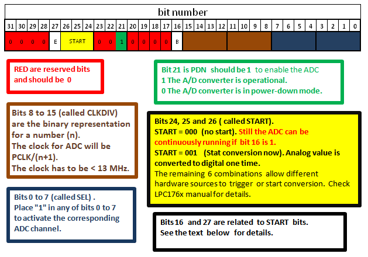
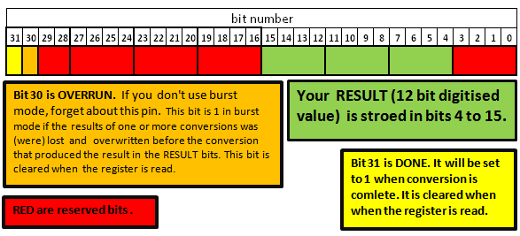

= Experiment 5: Analog Input and Output
Hazem Selmi; Ahmad Khayyat; Saleh AlSaleh
212, 11 January 2022

== Objectives

- Using the _Analog-to-Digital Converter (ADC)_ to read analog input

- Using the _Digital-to-Analog Converter (DAC)_ to write analog output

== Parts List

- LPC1768 mbed board
- USB A-Type to Mini-B cable
- Breadboard
- Light sensor and/or potentiometer
- Seven-segment display or set of LEDs
- 330-Ohm Resistors
- Jumper wires

== Background

Many microcontrollers have pins that can be used for _analog
input_. Because the microcontroller processes digital data only,
analog input must be converted to digital data. An analog-to-digital
converter (ADC) is an I/O circuit often integrated into
microcontrollers to allow directly connecting external analog devices,
such as sensors. The ADC would convert the sensor voltage into a
digital value by transforming it into a binary code with a specific
number of bits.

[TIP]
==================================================
Although not critical to conducting this experiment, it would be
useful to review the three steps involved in analog-to-digital
conversion: sampling, quantization, and bit encoding (COE 241).
==================================================

=== Using LPC1768 Peripherals

The LPC1768 includes an integrated ADC peripheral device. In general,
using any peripheral device involves three main issues:

. Powering up the peripheral
. Configuring the peripheral clock
. Configuring pin functions

==== Power Up

All microcontroller peripherals must be powered up before they can be
used. This was not a concern in earlier experiments because we were
using peripherals that are powered up by default.

Powering peripherals up and down is controlled through the _Power
Control for Peripherals Register_ (`PCONP`).

By referring to table 46 in Chapter 4 of the <<lpc1768-manual,LPC176x
manual>>, you can see that the reset value (default value) is 1 for
some peripherals, meaning that they are powered on by default, whereas
it is 0 (OFF by default) for others.

For example, in the timer experiment, if you use a timer other than
timer 0 or timer 1, your experiment wouldn't work without powering up
the timer in your program.

[NOTE]
==================================================
The A/D converter (ADC) power is controlled by bit 12 of the `PCONP`
register, which is 0 by default. _You must set that bit to power up
your ADC_.
==================================================

[TIP]
==================================================
To save power, you can turn the power OFF for any unused peripherals
that are ON by default.
==================================================

==== Peripheral Clock

Most of the microcontroller peripherals, including timers and the ADC,
require setting a peripheral clock (`PCLK`) to drive the peripheral.

You have seen in Experiment 7 (Hardware Timers) that you can configure
a device's `PCLK` using the `PCLKSEL0` and `PCLKSEL1` registers.

.Exercise
**************************************************
Refer to Chapter 4 in the <<lpc1768-manual,LPC176x manual>> to find
out the two bits needed to configure the `PCLK` frequency for the ADC.
**************************************************

.Exercise
**************************************************
What would happen if you skip this step?
**************************************************

==== Pin Functions

Many microcontroller pins can be configured to perform one of many
functions. From Experiment 3 (Interrupts), recall that the
`PINSELx` registers are used to configure a pin's function. To use the
ADC, you must set the function of an appropriate pin to be analog
input (`AD0.x` in the manual).

.Exercise
**************************************************
Refer to Chapter 8 of the <<lpc1768-manual,LPC176x manual>> to
determine:

. which `PINSELx` register should be modified
. which bits of the register should be modified
. what value should the bits be set to
**************************************************

You should connect a device that generates an analog voltage signal to
the selected pin. Examples of such devices are light sensors (LDR) and
potentiometers.

[NOTE]
==================================================
It is professional to correctly address the above three issues for
every peripheral you plan to use, regardless of the defaults.
==================================================

=== ADC Configuration

The main setup register for the ADC is the _A/D Control Register_
(`AD0CR`). The <<AD0CR_register,`AD0CR` Register Fields figure>>
illustrates the fields of the `AD0CR` register.

[NOTE]
==================================================
There is only _one_ ADC in the LPC1768 microcontroller. In the `LPC17xx.h`
header file, the control register is referred to as `ADCR`; while in the chip
manual it is called `AD0CR`. The reason for that is that some other chips have
multiple ADCs, named: `AD0CR`, `AD1CR`, etc.
==================================================

[[AD0CR_register]]
.A/D Control Register (`AD0CR`) Fields

The following table explains the function of the `B` (_Burst_) and
`E` (_Edge_) bits of the `AD0CR` register.

[NOTE]
==================================================
Bit 27 (`E`) works only if `B` = 0 and `START` ≥ 2. When 2 ≤ `START` ≤ 7, the
conversion starts when the state of a specific pin is changed. The `E` bit
decides whether the ADC is triggered on the positive edge or the negative edge
of that pin specified by `START`.
==================================================

[cols="^1,^1,^1,7",options="header",width="80%"]
|==================================================
| Bit | Label | Value | Effect
| 16  | `B`   | 0     | The `START` bits control when the ADC starts the conversion
|     |       | 1     | The ADC is continuously running (`START` should be `000`)
| 27  | `E`   | 0     | Start conversion on a falling edge
|     |       | 1     | Start conversion on a rising edge
|==================================================

==== START vs. BURST

Using `START` will perform the conversion only once.

If you want the analog value to be repeatedly converted, you
have two options:

. Set the `B` bit (Burst) of the `AD0CR` register to 1; or
. Set the `START` bits to `001` repeatedly, i.e. in a loop. The analog value is
  read every time such a statement is executed.

==== Using ADC Interrupt

In simple ADC applications, you don't need interrupts. You can simply read the
digitized value from the proper register whenever needed and take some
action. However, in some applications, such as real time applications, you may
need to interrupt the CPU to take an action _only when_ the conversion is
completed. To do that, you can use the `ADGINTEN` register.

TIP:  See Table 534 in Chapter 29 of the <<lpc1768-manual,LPC176x manual>> for details.

=== Reading Digital Values

There are 8 ADC channels, each corresponding to an analog pin. The digitized
value corresponding to an input analog voltage is stored in 12 bits in one of
the _A/D Data Registers_: `ADDR0` to `ADDR7`, where each register corresponds to
an analog pin.

The <<ADDR_register,`ADDR` Register Fields figure>> illustrates the fields of
the `ADDRx` registers.

[[ADDR_register]]
.A/D Data Register (`ADDR`) Fields

[NOTE]
==================================================
Using proper shifting and bitwise operations, you should be able to get the
proper value representing the analog voltage.
==================================================

[NOTE]
==================================================
The `DONE` and `OVERRUN` bits are less important (may not be needed) in `BURST`
mode. However in `START` mode, you may need to check them to avoid reading an
old or unintended value.
==================================================

.Using the `DONE` Bit
==================================================
To wait until the conversion of the ADC channel 3 is over, you may use:

[source,c]
--------------------------------------------------
while ((LPC_ADC->ADDR3 & (1 << 31)) == 0);    // Check the DONE bit for ADC channel #3
--------------------------------------------------
==================================================

The 12-bit digital value generated by the ADC ranges from 0 to
4095. The way to process this value depends on your application.

You may want to divide this range to a number of sub-ranges, and
assign different actions for each sub-range. In this case, you can use
an if-else block.

In many applications, however, you will want to map this range to a
another range using a mathematical formula. For example, if you are
reading from an analog temperature sensor, you would want to map the
0-to-4095 range to the range of temperatures supported by the sensor,
as specified in the sensor's data sheet. In most cases, a linear
relationship is sufficient.

=== Analog Output

To write analog values to an analog output device, use the LPC1768's
digital-to-analog converter (DAC) as follows:

. Use `PINSELx` to configure P0.26 to function as analog output
  (`AOUT`).

. Use the _D/A Converter Register_ (`DACR`) to set the digital value
  to be converted to analog.
+
Refer to Chapter 30 in the <<lpc1768-manual,LPC176x manual>> for
details.

== Tasks

. Use the ADC in LPC1768 to read an analog input device, such as the
  LDR (light sensor) or the potentiometer.
+
The output can be any thing you want. The seven-segment display is a
good option. You can simply display the analog level. If you use one
seven-segment display, you have 10 different levels (0 to 9).
+
It is recommended to use a formula to map the readings to sensible
values, instead of using an if-else block.

. Use the DAC in LPC1768 to output analog values to an analog device.

== Grading Sheet

[cols="5,1",options="header"]
|==================================================
| Task | Points

| Analog Input  | 5
| Analog Output | 2
| Discussion    | 3
|==================================================

[bibliography]
== Resources

* [[[lpc1768-manual]]] 
+ 
NXP Semiconductors. _UM10360 -- LPC176x/5x User
  Manual_. Rev. 3.1. 4 April 2014. +
  https://www.waveshare.com/w/upload/0/07/LPC176x5x_User_manual_EN.pdf  
