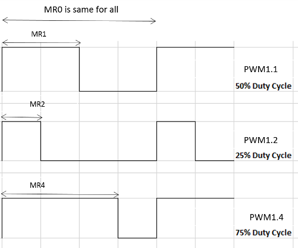

= Experiment 6: Pulse-Width Modulation
Hazem Selmi; Ahmad Khayyat; Saleh AlSaleh
212, 11 January 2022

== Objectives

- Understanding and using _pulse-width modulation (PWM)_.

== Parts List

- LPC1768 mbed board
- USB A-Type to Mini-B cable
- Breadboard
- RGB-LED or buzzer
- Jumper wires
- Servo motor

== Background

=== Pulse-Width Modulation (PWM)

A pulse-width modulated (PWM) signal is a periodic square wave
signal. The difference between a PWM signal and a clock signals is the
flexibility of its _duty cycle_.

A periodic square wave is high for some part of its period, and low
for the rest of the period. Its _duty cycle_ is the percentage of the
period for which the signal is high. Usually, a clock wave has a duty
cycle of 50%. In a PWM signal, the duty cycle is controllable. The
name is derived from the idea that the _width_ of the high _pulse_ is
_modulated_ according to some value.

=== PWM Applications

PWM has many useful applications in embedded systems. The main two
categories are:

. When a microcontroller does not have a DAC circuit, PWM can be used
  to _modulate_ different analog values.

. Some devices are built to be used with PWM. The most famous example
  is servo motors.
+
Servo motors usually require a 50-Hz square wave (period of 20 ms). The duration
of the high pulse determines the motor's angle. Usually, the full swing of the
servo corresponds to a high interval of 1 to 2 ms, whereas a high interval of
1.5 ms corresponds to the neutral servo position
footnote:[https://circuitdigest.com/article/servo-motor-basics].

=== Generating PWM with LPC1768

The LPC1768 features a pulse-width modulator peripheral. The generic
steps discussed in Experiment 5 for setting up a peripheral device
apply here:

. Power: the PWM circuit is powered on by default.
. Peripheral Clock (PCLK): recall that the default division factor is 4.
. Pin functions: a PWM pin must be configured for PWM use.

Additionally, generating a PWM signal in particular requires:

. Setting the period of the PWM signal using the `MR0` register.
. Specifying the duty cycle using an `MRx` register, which would control the
  `PWM1.x` output.
. The PWM circuit should be enabled to generate a PWM signal, otherwise it will
  act as a standard timer (or counter).
. The corresponding `PWM1.x` output should be enabled.

[TIP]
==================================================
. There is only one PWM circuit, called `PWM1`. That does not imply that there
  is a `PWM0` or `PWM2`.

. There are six PWM channels, referred to as `PWM1.1` to `PWM1.6`.

. You have the option of more than one pin to pin out any of the
  channels.
==================================================

[NOTE]
==================================================
If you care about the accuracy of your PWM output voltage levels, you need to
disable the pull-up resistor to avoid affecting the PWM voltage. That can be
done using the `LPC_PINCON->PINMODEx` register.

In many applications this is not required.
==================================================

.Exercise
**************************************************
Refer to chapter 8 of the <<lpc1768-manual,LPC176x manual>> to
determine:

. Which pins are you going to use for PWM?
. Which `PINSELx` register should you use?
. Which `PINSELx` bits should you set?
. To what value should you set those `PINSELx` bits?
. How to disable the pull-up resistor?
**************************************************

==== `MR0` and `MRx`

To fully specify a PWM signal, you need to specify:

. Its period (or, equivalently, its frequency)
. Its duty cycle

The value of the `MR0` register (aka `PWM1MR0`) determines the period, while any
of the `MR1` to `MR6` registers determine the duty cycle for the corresponding
`PWM1.1` to `PWM1.6` outputs, as illustrated in the following example.

.Period and Duty Cycles
==================================================
If `MR0` is set to 80, then:

[cols="^,^,^,^",width="60%"]
|=================================================
| Register | Value | Duty Cycle | PWM Channel
| `MR1`    | 40    | 50%        | 1 (`PWM1.1`)
| `MR2`    | 20    | 25%        | 2 (`PWM1.2`)
| `MR4`    | 20    | 75%        | 4 (`PWM1.4`)
| `MR5`    | 72    | 90%        | 5 (`PWM1.5`)
|=================================================

The figure below shows the different PWM outputs for the same `MR0`.

==================================================

.Single Edge Controlled PWM
[NOTE]
==================================================
In the example above, the periodic signal on all channels will go high
at the beginning of the period, and each channel will be reset when
matching the number in the corresponding `MR1` to `MR6` register.

This PWM configuration is called _single edge controlled PWM_.
==================================================

In summary:

. Control the period duration of the PWM signal by setting the `MR0` register.
. Use the appropriate `MRx` register to control the duty cycle of `PWM1.x`,
  where `x` is a number between 0 and 6.

.A PWM Period of 1 Second
==================================================
[source,c]
--------------------------------------------------
LPC_PWM1->MR0 = 1000000; // PWM period is (1000000*PCLK_PERIOD) second.
--------------------------------------------------
==================================================

To have different PWM channels be set and reset at different times,
some PWM channels can be configured as _double edge controlled PWM_
signals.

.Double Edge Controlled PWM
[NOTE]
==================================================
In double edge controlled, you can control when to set or reset the
pulse within the period, and whether to set or reset first.

The `MR0` register still controls the duration of the full period.
==================================================

.Double Edge Controlled PWM
==================================================
PWM channel 2 (`PWM1.2`) is set by `MR1` and reset by `MR2`.

So, setting `MR0` = 100, `MR1` = 50, and `MR2` = 75 will result in a
signal that is low at the beginning of the period, becomes high in the
middle of the period, and goes back to low in the middle of the second
half of the period.

In contrast, setting `MR0` = 100, `MR1` = 75, and `MR2` = 50 will
result in a signal that is high at the beginning of the period, becomes
low in the middle of the period, and goes back to high in the middle
of the second half of the period.

// TODO: illustrate this example with a figure (later, It needs time and it is
// not that important!! Double Edge only benefit is to give you the freedom to
// choose where the high pulse is located within a single period. In the long
// run any double edge signal can be identical to a single edge one with some
// shift. The difference in shape would be having the pulse in the beginning of
// the first period while it is in the middle of double edge signal. So, in a
// single PWM task or multiple unrelated PWM signals, single edge is enough!
// Double edge control is required only if multiple pwm with different pulse
// location within the period. This is rare and only example I came across is
// "multi-phase motor control typically requires three non-overlapping PWM
// outputs with individual control of all three pulse widths and positions."
// [lpc_1769 manual]

// TODO: delete the section (double edge) completely or use part of my above
// statements to explain the difference!

==================================================

[NOTE]
==================================================
PWM channels can be configured to be _single edge controlled_ or
_double edge controlled_ using the `PWMSELn` bits of the _PWM Control
Register_ (`PWM1PCR` or `LPC_PWM1->PCR`).

For details, see Table 444 and Table 452 in the <<lpc1768-manual,LPC176x
manual>>.
==================================================

==== PWM vs. Timers

From a hardware point of view, PWM is based on the standard timer block, and
inherits all of its features <<lpc1768-manual>>.

Let us review the relation between the timer counter, the prescale register, and
the prescale counter. `TC` is a 32-bit register that is incremented every
`PR` + 1 cycles of `PCLK`, where `PR` is the _Prescale Register_ (`PWM1PR` or
`LPC_PWM1->PR` in CMSIS).

[IMPORTANT]
==================================================
Recall that you can use the default value of the `PR` register (0) to simply
increment `TC` every `PCLK` pulse.
==================================================

IF `PR` is set to a non-zero value, ``TC``'s frequency would be given by:

`TC` frequency in Hz = latexmath:[\displaystyle\frac{\textrm{System
clock}}{\textrm{PCLK divisor} \times (\textrm{PR} + 1)}]

where _PCLK divisor_ is 1, 2, 4, or 8, depending on the setting of the
`PCLKSELx` register (default is 4).

For _system clock_, you can use the `SystemCoreClock` variable, which
is set by CMSIS to the CPU clock speed.

.Setting the Prescale Register
==================================================
To set the prescale register such that `TC` is incremented every 1
µs (frequency of 1,000,000 Hz):

[source,c]
--------------------------------------------------
LPC_PWM1->PR = SystemCoreClock / (4 * 1000000) - 1;
--------------------------------------------------
==================================================

If `MR0` is set to 100, every 100 pulses of the _PWM Timer Counter_ register
(`PWM1TC`, or `TC` for short), a new PWM period starts. That happens even if
`TC` is not reset. This is an important operational difference between pure
timers and a PWM signals. The other crucial difference is the control of the
duty cycle, which is at the heart of the the PWM concept.

==== Summary of Important PWM Control Registers

- `LPC_PWM1->LER` is used to latch the new `MRx` values. You must use
  it every time you change any of the `MRx` values.

- `LPC_PWM1->PCR` is used to enable PWM1 with single or double edge
  operation. If ignored, PWM will act as a counter.

- `LPC_PWM1->TCR` is used to enable, disable, or reset counting in the
  `TC` register. You should use it at least once to enable counting.

- `LPC_PWM1->MCR` is similar to the timers' `MCR` registers. It can be used to
  generate interrupts or reset `TC` when matches occur if needed.

== Tasks

. Basic operation: Write a program that generates a PWM signal, and use it on an
  external device.

. Control a servo motor: Rotate a servo motor 90 degrees to the right, move
it back to the neutral position, then rotate it 90 degrees to the left.

. Show different colors on an RGB LED using at least two PWM signals

== Grading Sheet

[cols="5,1",options="header"]
|==================================================
| Task | Points

| Basic operation       | 3
| Servo Control        | 7
| Bonus: RGB            | +2
|==================================================

[bibliography]
== Resources

* [[[lpc1768-manual]]]
+
NXP Semiconductors. _UM10360 -- LPC176x/5x User
  Manual_. Rev. 3.1. 4 April 2014. +
  https://www.waveshare.com/w/upload/0/07/LPC176x5x_User_manual_EN.pdf

