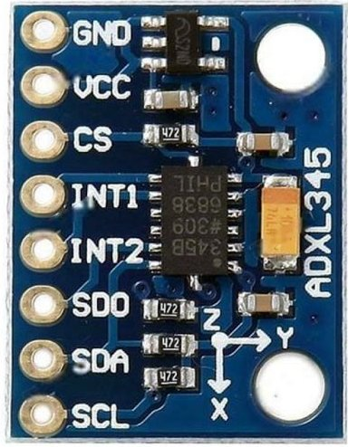
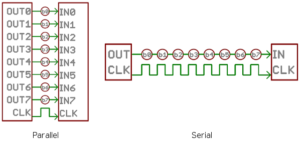
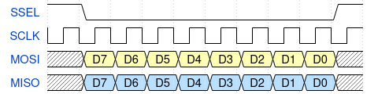
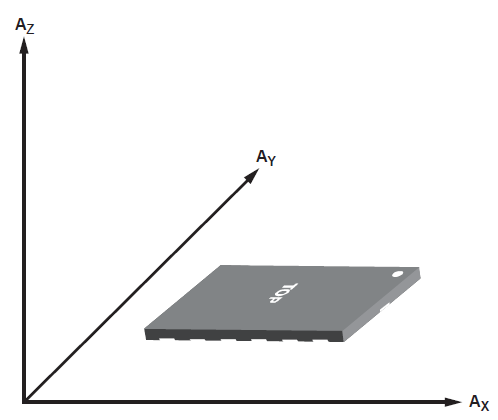

= Experiment 7: Serial Communication
Hazem Selmi; Mohannad Mostafa; Ahmad Khayyat; Saleh AlSaleh
212, 21 February 2022

== Objectives

- Introduction to serial communication protocols

- Using the _Serial Peripheral Interface_ (SPI) protocol

== Parts List

- LPC1768 mbed board
- USB A-Type to Mini-B cable
- Breadboard
- Jumper wires
- ADXL345 Accelerometer Module
+
.ADXL345 Accelerometer Module

== Background

In this experiment, you will use one of the serial communication
interfaces of the LPC1768 microncontroller, specifically the SPI
interface (through the SSP controller), to interact with a digital
accelerometer.

=== SPI Communication Using the LPC1768 Microcontroller

==== Serial vs. Parallel Communication

Serial communication is the process of sending data one bit at a time,
sequentially. In contrast, parallel communication involves sending multiple
bits at the same time, as illustrated in the <<parallel-vs-serial,
Parallel vs. Serial Communication figure>> below.

[[parallel-vs-serial]]
.Parallel vs. Serial Communication

Some of the main differences between serial and parallel communication
are:

- A parallel link requires more wires, occupying more space and
  resulting in higher cost.

- To keep all wires in a parallel link synchronized, the link rate is
  limited. In contrast, serial links can sustain much higher clock
  rates.

- Parallel links are more susceptible to crosstalk interference.

- Parallel communication between ICs require more pins, increasing the
  IC cost.

- Parallel communication is easier to implement because it does not
  require data serialization and deserialization.

Serial communication is becoming more common for transmitting data
between a computer and a peripheral device or even another computer,
as improved signal integrity and transmission speeds in newer serial
technologies have begun to outweigh the parallel bus's advantages.

==== Serial Communication Protocols

Example serial communication standards include USB, FireWire, Serial
ATA (SATA), PCI Express (PCIe), and Ethernet. Serial protocols commonly
used in embedded systems include UART, I^2^C, and SPI.

Serial communication protocols can be synchronous or asynchronous. An
asynchronous protocol sends a _start signal_ prior to each code word,
and a _stop signal_ after each code word. UART is an asynchronous
serial protocol supported by UART interfaces.

A synchronous serial protocol sends a _clock_ signal on a dedicated
wire. Additional wire(s) are required for data. I^2^C and SPI are
synchronous serial protocols.

==== LPC176 Serial Interfaces

The LPC1768 microcontroller provides the following serial interfaces
(<<lpc1768-manual,LPC1768 Manual>>):

- Two _Synchronous Serial Port_ (SSP) controllers, SSP0 and SSP1, with
  multi-protocol capabilities. They can operate as SPI, 4-wire TI SSI,
  or Microwire bus controllers.

- A _Serial Peripheral Interface_ (SPI) controller. SSP0 is intended
  to be used as an alternative for the SPI interface. SPI is included
  as a legacy peripheral.

- Three enhanced _Inter-Integrated Circuit_ (I^2^C) bus interfaces,
  one supporting the full I^2^C specification, and two with standard
  port pins. I^2^C is pronounced I-squared-C.

- Four UARTs.

- A two-channel CAN controller.

- Ethernet MAC with RMII interface and dedicated DMA controller.

- USB 2.0 full-speed controller that can be configured for either
  device, host, or OTG operation with an on-chip PHY for device and
  host functions and a dedicated DMA controller.

In this experiment, we will use the SSP interface configured for the
SPI protocol.

==== Serial Peripheral Interface (SPI)

SPI is a four-wire, full-duplex, master-slave bus that was created by
Motorola. There can be only a single master. Multiple slaves are
allowed with individual _slave select_ (`SS` or `SSEL`) lines. The
four wires are:

. `SCLK`: Serial Clock (output from master)
. `MOSI`: Master Output, Slave Input (output from master)
. `MISO`: Master Input, Slave Output (output from slave)
. `SSEL`: Slave Select (active low, output from master) -- one per slave

The microcontroller is usually the master. It uses the `MOSI` pin to
send data, and the `MISO` pin to read data. The `SCLK` pin dictates
the transmission rate; a bit is sent/received every clock pulse. A
simple timing diagram for writing data is shown below.

.Timing diagram for writing data on a SPI bus

The _slave select_ (`SSEL`) signal is used to select the slave in a
data transfer. `SSEL` is active low: it must be low before the
transaction begins, and must stay low for the duration of the
transaction.

To connect multiple slaves, you need a dedicated `SSEL` for each
slave. All slaves can share the remaining wires.

Even though the `SSEL` signal is a part of the SPI protocol, it is not
uncommon to leave its control to the software instead of the SPI/SSP
controller. The <<lpc1768-manual,LPC176x manual>> states that "This
signal is not directly driven by the master. It could be driven by a
simple general purpose I/O under software control." In the LPCXpresso
Base Board, `SSEL` is connected to GPIO P2.2. It should be driven low
(by software) prior to placing data in the _Data Register_ (`DR`), and
then switched back to high.

==== Using SSP/SPI in LPC1768

The section describes how to use the SSP interface of the LPC1768
microcontroller as an SPI interface by listing the involved registers
and their functions.

===== Data Register (`DR`)

The data to be sent serially must be loaded into the SSP _Data Register_
(`LPC_SSP1->DR`). The serial transfer rate is controlled by the SSP
clock as described below.

[IMPORTANT]
========================================
The `LPC_SSP1→DR` register has both a transmitter FIFO and a receiver FIFO.

To transmit the value stored in x, you can use:

`LPC_SSP1->DR = x;`

Similarly, to receive a new value and store in x, you can use:

`x = LPC_SSP1->DR;`

========================================

[IMPORTANT]
========================================
Every time you send data by writing to the `LPC_SSP1->DR` register,
some data are also received in that same register. Make sure you read
that data to clear the receiver buffer.

Also, to be able to receive something from a slave, you need to trigger the two way communication by putting dummy data in the DR.
========================================

===== SSP Control Registers

There are two control registers for the `SSP1` interface (see
`LPC17xx.h`):

. `SSP1CR0`: can be accessed as `LPC_SSP1->CR0`
. `SSP1CR1`: can be accessed as `LPC_SSP1->CR1`

The `CR0` register has 5 fields:

. Data size (bits 0-3): the number of bits transferred in each
  frame.

. Frame Format (bits 4-5): the serial protocol to be used.
+
[horizontal]
00 :: SPI
01 :: TI
10 :: Microwire
11 :: Not supported

. Clock Out Polarity (bit 6): should be 0 in our application.

. Clock Out Phase (bit 7): should be 0 in our application.

. Serial Clock Rate (`SCR`) (bits 8-15): used with the _Clock Prescale
  Register_ (`CPSR`) to control the SSP clock. This is crucial when
  the SSP peripheral requires a specific value or range of
  frequencies.

The `CR1` register has 4 fields, the most crucial of which is bit 1:
_SSP enable_.

In addition to `CR0` and `CR1`, there is the SSP _Clock Prescale
Register_ (`CPSR`). The `CSPR` register contains a single field,
`CPSDVSR`, in bits 0-7. Its remaining bits are reserved (unused).

The SSP clock frequency is calculated using the formula:

[latexmath]
++++++++++++++++++++++++++++++++++++++++++++++++++
\text{SSP frequency} = \frac{\tt PCLK}{\tt CPSDVSR \; (SCR + 1)}
++++++++++++++++++++++++++++++++++++++++++++++++++

[IMPORTANT]
==================================================
The SSP's `CPSR` register must be properly initialized. Otherwise, the
SSP controller will not be able to transmit data correctly.
==================================================

[NOTE]
==================================================
For details, see Tables 371, 372, and 375 in the
<<lpc1768-manual,LPC176x manual>>.
==================================================

.Exercise
**************************************************
What values of `CPSDVSR` and `SCR` will result in the highest SSP
frequency?
**************************************************

///////////////////////
[Answer]
CPSDVSR = 2 and SCR=0
///////////////////////

.Exercise
**************************************************
If the frequency of `PCLK` is 25 MHz, what would be the shortest
possible amount of time to generate eight `SCLK` pulses?
**************************************************

///////////////////////
[Answer]
SCLK = 25 MHz / (2 * 1)= 12.5 MHz.
8 KLCK pulses = 80 ns * 8 = 640 ns.
///////////////////////

=== Using the ADXL345 Accelerometer

The ADXL345 chip is a system-in-package featuring a 3D
digital linear acceleration sensor. It includes both I^2^C and SPI interfaces. It also can be configured to generate an interrupt signal for activity and inactivity, sensing detect the presence or lack of motion by comparing the acceleration on any axis with user-set thresholds. 
The accelerometer part can be enabled or put into power-down mode.

To be able to conveniently use the ADXL345 chip, we will be using the
ADXL345 carrier module/board.

==== Accelerometers

An accelerometer is an electromechanical device that will measure
acceleration forces. These forces may be static, like the constant
force of gravity pulling at your feet, or they could be dynamic,
caused by moving or vibrating the accelerometer.

An accelerometer can help your project understand its surroundings
better. Is it driving uphill? Is it going to fall over when it takes
another step? Is it flying horizontally? A good programmer can write
code to answer all of these questions using the data provided by an
accelerometer. An accelerometer can even help analyze problems in a
car engine using vibration testing.

In the computing world, IBM and Apple have been using accelerometers
in their laptops to protect hard drives from damage. If you
accidentally drop the laptop, the accelerometer detects the sudden
freefall, and switches the hard drive off so the heads don't crash on
the platters. In a similar fashion, high-g accelerometers are the
industry standard way of detecting car crashes and deploying airbags
at just the right time. <<accelerometers>>

==== The ADXL345 SPI Interface

The ADXL345 chip provides an SPI interface with the device acting as a
slave on the SPI bus. It allows writing and reading the registers of
the device. The serial interface interacts with the outside world
through 4 wires: `CS`, `SCL`, `SDA` and `SDO`.

[NOTE]
==================================================
Check the <<adxl345-manual, ADXL345 datasheet>>. Read the _`SPI bus
Interfaces`_ section to find out how to read from and write to the
registers of ADXL345.
==================================================

==== Using the ADXL345 Accelerometer

The accelerometer measures acceleration along the three dimensions,
and makes them available in the following registers:

`DATAX0` (32h) LSB, `DATAX1` (33h) MSB ::
X-axis acceleration data. The value is expressed in 10 bits as 2's complement.
`DATAY0` (34h) LSB, `DATAY1` (35h) MSB ::
Y-axis acceleration data. The value is expressed in 10 bits as 2's complement.
`DATAZ0` (36h) LSB, `DATAZ1` (37h) MSB ::
Z-axis acceleration data. The value is expressed in 10 bits as 2's complement.

The <<accelerometer-directions>> figure shows the directions
corresponding to positive values along each of the three axes,
relative to the chip.

[[accelerometer-directions]]
.Directions of the Three Accelerometer Readings

[IMPORTANT]
==================================================
You must configure the `POWER_CTL` register in order to read the
accelerometer data.
==================================================

[TIP]
==================================================
Reading data from the accelerometer device is completed in 16 clock
pulses. Thus, in order to read the data correctly from the registers,
you have 2 options: send multiple 8-bit data, or send 16-bit data. The
description is as follows:

. Send the first 8 bits, which include the read/write bit and the
  address bits of the register that you want to read. As a result of
  generating the clock pulses required to send this byte, you will
  receive dummy data. Then, send another 8 bits of dummy data just to
  generate the required clock pulses to receive the requested 8-bit
  data.

 . Send 16-bit data, where the first 8 bits include the read/write bit
   and the register address, and the next 8 bits contains the data to
   write, in case of a write command, or dummy data if you are
   reading.
==================================================

== Tasks

. Use the LPC1768's SSP/SPI interface to read the accelerometer data
  from the ADXL345 device.

. Write a simple application to indicate different stationary
  positions. For example, indicate whether the device is tilted to the
  right or to the left, tilted forward or backward, and whether it's
  facing upward or downward. Use some output device to reflect this
  data in real-time. The following table summarizes the readings
  corresponding to each of the six stationary positions.
+
[options="header,autowidth"]
|==================================================
| Stationary Position | Ax | Ay | Az
| Z down              | 0  | 0  | -
| Z up                | 0  | 0  | +
| Y down              | 0  | -  | 0
| Y up                | 0  | +  | 0
| X down              | -  | 0  | 0
| X up                | +  | 0  | 0
|==================================================

== Grading Sheet

[cols="5,1",options="header"]
|==================================================
| Task | Points

| Operate a seven-segment display using the SSP/SPI interface | 7
| Discussion | 3
|==================================================

[bibliography]
== Resources

* [[[base-board-manual]]]
+
Embedded Artists AB. 'LPCXpresso Base Board
Rev B User's Guide'. 2013-01-25. +
http://www.embeddedartists.com/sites/default/files/support/xpr/base/LPCXpresso_BaseBoard_rev_B_Users_Guide.pdf

* [[[lpc1768-manual]]] 
+ 
NXP Semiconductors. _UM10360 -- LPC176x/5x User
  Manual_. Rev. 3.1. 4 April 2014. +
  https://www.waveshare.com/w/upload/0/07/LPC176x5x_User_manual_EN.pdf  

* [[[accelerometers]]]
+
Dimension Engineering Inc. 'A Beginner's Guide
to Accelerometers'. Retrieved: 2015-11-7. +
http://www.dimensionengineering.com/info/accelerometers

* [[[adxl345-manual]]]
+
Analog Devices. 'ADXL345 Digital Accelerometer Datasheet'. +
https://www.analog.com/media/en/technical-documentation/data-sheets/ADXL345.pdf

