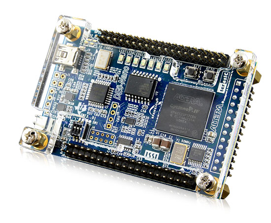

= Experiment 8: Microcontroller on an FPGA
Mohannad Mostafa; Ahmad Khayyat; Hazem Selmi; Saleh AlSaleh
212, 11 January 2022
:highlightjs-languages: verilog

== Objectives

In this experiment, you will learn about the hardware of a
microcontroller by:

- Building a microcontroller system on an FPGA by integrating Altera's
  Nios II soft processor and a few peripherals

- Writing software for the FPGA-based microcontroller system

== Parts List

- Altera DE0-Nano FPGA board
+

- USB A-Type to Mini-B cable

== Background

This experiment involves two main tasks:

. Building the hardware for a microcontroller system using an FPGA
  device.
+
We will use Altera's _DE0-Nano_ FPGA development board, which
incorporates a small FPGA device and a number of peripherals. To
create the microcontroller system, we will configure the FPGA device
to implement a soft processor and a number of required components for
the processor to function properly.
+
To configure the FPGA, we will use Altera's _Quartus II_ design
software. To build the soft processor system, we will use Altera's
_Qsys_ system integration software to implement a system around
Altera's Nios II soft processor core.

. Developing software to exercise your microcontroller system.
+
We will use Altera's Eclipse-based _Nios II Embedded Design Suite
(EDS)_ software development environment to build software for the Nios
II-based hardware system.

[NOTE]
.Intel (Altera) Software
==================================================
You can obtain and install all the required software for this
experiment freely from Altera's website. You will want to download and
install _Quartus II Web Edition software_, which includes Qsys, the
Nios II EDS, and Altera IP Library.

Intel acquired Altera in 2015. Altera Quartus II software suite has been renamed to Intel Quartus.
Qsys has been renamed to Platform Designer.

The free version of Quartus software is now called Intel Quartus Prime Lite Edition. 

For more details on available Altera software, software licensing,
download options, and hardware and software requirements, consult the
<<quartus-install,Intel® FPGA Software Installation
and Licensing>>
document.
==================================================

=== The DE0-Nano FPGA Board

The DE0-Nano is a low-cost, low-power, portable, compact board (49 mm
x 75 mm) aimed at developing embedded soft processor systems using the
Nios II processor.

.Board Features

- Three-axis accelerometer with 13-bit resolution
- Eight-channel, 12-bit resolution analog-to-digital (A/D) converter
- Expansion headers: two 40-pin headers and one 26-pin header
- Two-pin external power header
- 32-MB SDRAM
- 2-Kb EEPROM
- Eight green LEDs
- Four dual in-line package (DIP) switches
- Two push-button switches

=== The Nios II Processor

Nios II is a RISC soft processor architecture. A soft processor is a
processor that can be implemented on reconfigurable logic, e.g. an
FPGA.

.Nios II Processor Features

- Full 32-bit instruction set, data path, and address space
- 32 general-purpose registers
- 32 interrupt sources
- External interrupt controller interface for more interrupt sources
- Optional floating-point instructions for single-precision
  floating-point operations
- Access to a variety of on-chip peripherals, and interfaces to
  off-chip memories and peripherals
- Hardware-assisted debug module enabling processor start, stop, step,
  and trace under control of the Nios II software development tools
- Optional memory management unit (MMU) to support operating systems
  that require MMUs
- Software development environment based on the GNU C/C++ tool chain
  and the Nios II Software Build Tools (SBT) for Eclipse

The <<nios-ii-ref,Nios II Processor Reference Handbook>> states that:

[quote, Nios II Processor Reference Handbook]
__________________________________________________

A Nios II processor system is equivalent to a microcontroller or
"computer on a chip" that includes a processor and a combination of
peripherals and memory on a single chip. A Nios II processor system
consists of a Nios II processor core, a set of on-chip peripherals,
on-chip memory, and interfaces to off-chip memory, all implemented on
a single Altera device. Like a microcontroller family, all Nios II
processor systems use a consistent instruction set and programming
model.
__________________________________________________

[TIP]
==================================================
For more information on the Nios II processor, consult <<nios-ii,its
extensive documentation>>.
==================================================

=== Design Flow

Unlike previous experiments, we need to create the hardware of the
microcontroller system before we can program it.

In order to create a Nios II soft processor system on the Altera
DE0-Nano FPGA board, and write software for it, you are going to use
the following software tools:

System Builder :: used to generate a preconfigured Quartus II project for the DE0-Nano FPGA development board.

Quartus II :: used to compile all design files, including those
generated by Qsys, into an FPGA configuration file, known as an _SRAM
Object File_ (`.sof`), which can be downloaded into the FPGA device to
implement the designed system.

[NOTE]
=====================================

.Altera vs. Xilinx Tools

Quartus II is the design software used to develop hardware for Altera FPGAs. DE0-nano is a development board that contains an Altera FPGA chip.

In contrast, for Xilinx FPGAs, ISE design suite is the design software used to develop hardware for Xilinx FPGAs, and Spartan, for example, is a board that contains a Xilinx FPGA chip.
=====================================

Qsys (Platform Designer):: used to specify the Nios II processor core(s), memory, and
other components your system requires. Qsys automatically generates
the interconnect logic to integrate the components in the hardware
system.

Nios II EDS :: the Nios II Embedded Design Suite includes Nios II
Software Build Tools (SBT) for Eclipse, which is an eclipse
installation preconfigured to use a set of plugins to support
developing software for the Nios II processor. To create a new Nios II
C/C++ application project, the Nios II SBT for Eclipse uses
information from the files generated by Qsys to learn about the target
hardware.

Here is a summary of the general flow steps; the details will come later

. Use the System Builder utility to generate a Quartus II project preconfigured for the DE0-Nano board. This step is specific to the DE0-Nano board.

. Use Qsys to generate the hardware description of your processor system. In addition to the HDL files, Qsys generates an `.sopcinfo` file that describes the system.

. Use Quartus II to compile the hardware description generated by   Qsys into an FPGA configuration file (`.sopcinfo`), and to download the configuration file into the FPGA to implement the system's hardware.

. Use Nios II SBT for Eclipse to develop the software for the
  configured hardware. Nios II SBT for Eclipse learns about the
  hardware from the Qsys-generated `.sopcinfo` file, in order to
  compile the software for the generated hardware.

//////////////////////////////////////////////////
TODO: list SBT-generated file types that we actually are going to use
in this experiment
//////////////////////////////////////////////////

=== Creating a Quartus II Project

The Quartus II project will eventually contain all the information required to generate and implement the hardware of our system.

The DE0-Nano kit ships with a convenient software utility called
_System Builder_, which creates preconfigured Quartus II projects for
the DE0-Nano board. For example, it automatically configures the
project for the FPGA device in the DE0-Nano, and configures the pin
locations for the selected peripherals.

Run the DE0-Nano's System Builder utility, and choose the following
configuration options:

- CLOCK
- LED x 8
- EEPROM, 2KB
- SDRAM, 32MB

Then, press _Generate_ to create a Quartus II project. After that, open the generated project in Quartus II by opening the `.qpf` file. In the next section, we will use Qsys from within this project.

[IMPORTANT]
==================================================
Avoid using directories with spaces in their names for your Quartus II
or Nios II EDS projects.
==================================================

[NOTE]
==================================================
Since the purpose of this experiment is to understand the makeup of a microcontroller system, it is suggested to create a minimal system by only including the few peripherals listed above. But you are welcome to include any of the other available peripherals.

For example, the DE0-Nano FPGA board has a built-in accelerometer. You are free to try to use it if you manage to complete the listed tasks in this experiment!
==================================================

=== Building the Processor System Using Qsys

Qsys allows you to put together the hardware components that make up your microcontroller system, and to create all the required connections, including the system bus.

We would like to build a Nios II system that includes the following
hardware components:

- Nios II/s core with 2 KB of instruction cache
- 20 KB of on-chip memory
- Timer
- JTAG UART
- Eight output-only parallel I/O (PIO) pins
- System ID component

[TIP]
==================================================
For more information about these and other components, refer to the
<<periph-ip-ug,Embedded Peripherals IP User Guide>>.
==================================================

To build this system, run Qsys from the _Tools_ menu in Quartus II,
and follow the instructions in the <<nios-ii-hw-tut,Nios II Hardware
Development Tutorial>>, page 1-11 (_Define the System in Qsys_
section).

[IMPORTANT]
===================================================
.Qsys Errors

While you are adding the components, connecting them, and configuring them, there will be error messages disappearing gradually till you correctly complete your design. Theses error messages can be useful in reminding you of any missed step.
===================================================

[IMPORTANT]
===================================================
.Qsys Notes

. Edit the export column for the three components: clk_in, clk_in_reset, and external connection.

. Edit the name of the memory component to use a simple short name (e.g. ram).

. After adding the CPU core, use the name of your memory component as Reset Vector memory and exception Vector memory.

. Edit the IRQ numbers in the IRQ column to be 16 for the JTAG UART component, and 1 for the timer.

. Edit the PIO component name to a simple short name that you can remember. You will need it later.

. Generate the base addresses automatically by choosing Assign Base Addresses from the Tools menu in Qsys.

. Finally, use the generate button in Qsys to generate the project files and save them in a known directory.
===================================================

[NOTE]
===================================================
.Qsys Components

By following the Nios II Hardware Development Tutorial, you may have some questions about some of the components. Here are some answers for such anticipated questions:

. Although the tutorial asks you to set the cashe size, we don’t care about the cache in this experiment. We can use a CPU with no cache. It makes no difference for the purposes of this experiment.

. JTAG UART is used by the development environment to communicate with the microcontroller that we are creating on the FPGA, especially to download and debug software. JTAG is a standard created for this purpose specifically.

. System ID is similarly used by the development tools to identify the target hardware and determine which software to download to which hardware. You can set the target system ID value in the IDE to match the value you may set in the System ID hardware component, in case you use a non-default value.

. Usually, IRQ numbers need to be configured in device drivers or system software. The values set for the JTAG UART and the timer components are the numbers configured in the base system software generated by the Nios II IDE.
===================================================

Your completed Qsys system should look like this:

//////////////////////////////////////////////////
TODO: the linked tutorial creates RAM only. Consider adding
instructions (or linking to an alternative tutorial) for adding
separate RAM and ROM.
//////////////////////////////////////////////////

=== Integrate the Qsys System into the Quartus II Project

To integrate the Qsys system with the Quartus II project, we need to:

. Add the Qsys system to the Quartus II project

. Instantiate the Qsys system

. Connect the ports of the Qsys sytem to signals in the Quartus II
  project.

For Quartus II to be able to recognize the Qsys system, the Qsys
system, represented by its Quartus II IP file (`.qip`), must be added
to the Quartus II project as follows:

. From the Quartus II menu, select _Project_ > _Add/remove Files in
  project_

. Click the browse button (`...`) next to the _File name_ field

. Select the file `<qsys_project_directory>/synthesis/<qsys_project_name>.qip`

. Click _Add_ to include `.qip` file in the project, then click _OK_
  to close the dialog box

To instantiate the Qsys-generated Nios II system, and to connect each
port of the Qsys system instance to the appropriate signal in the
top-level module of the Quartus II project, use the following Verilog
instantiation code in the top-level module of your Quartus II project,
which is typically named `<quartus_project>.v`, where
`<quartus_project>` is the name of your Quartus II project.

[source,verilog]
.Verilog Code to Instantiate the Qsys-Generated System
--------------------------------------------------
<qsys_project> u0(
    .clk_clk (CLOCK_50),
    .reset_reset_n (1'b1),
    .led_pio_external_export (LED)
);
--------------------------------------------------

[TIP]
.About the Qsys-system-instantiation Verilog Code
==================================================
In the Verilog code above, replace <qsys_project> with the name of
your Qsys project.

The code creates an instance, named `u0`, of the Qsys system, and
maps, i.e. connects, the ports of the Qsys system (the names following
the periods) to signals declared in the module in which this code
resides (the names between parentheses). `1'b1` is a single-bit
constant value of `1`.

The exported port names of the Qsys system are derived from the Qsys
system definition.
==================================================

=== Compile and Download the Hardware Design

The Quartus II hardware compiler consists of a set of modules that
perform different compilation steps. The modules are _Analysis &
Synthesis_, the _Fitter_, the _Assembler_, and the _TimeQuest Timing
Analyzer_. To obtain the downloadable `.sof` FPGA configuration file,
we need to run the assembler. Running the assembler will trigger all
other required modules.

After compiling the Quartus II Project, connect the DE0-Nano board to
your PC in order to download the hardware design.

[NOTE]
==================================================
To download the FPGA configuration data file (`.sof`) to a the FPGA
device, you use Altera's USB-Blaster download cable, which interfaces
a USB port on your host computer to the Altera FPGA.

The USB-Blaster cable requires a driver for the host computer to
recognize it. For details on using the USB-Blaster and installing its
driver, refer to the <<usb-blaster,USB-Blaster Download Cable User
Guide>>.

The driver has already been installed on the lab PCs.
==================================================

To download your hardware design to the FPGA:

. Run the programmer from the _Tools_ menu in Quartus II

. Click the _Hardware Setup_ button and choose _USB-Blaster_ if it is
  not selected

. Click the _Start_ button to start downloading the `.sof` file to the
  FPGA chip on your board.

[IMPORTANT]
==================================================
Don't close the _OpenCore Plus Status_ dialog when it appears.
==================================================

[TIP]
==================================================
For more details on downloading your design to the FPGA, refer to the
_Download the Hardware Design to the Target FPGA_ section of the
<<nios-ii-hw-tut,Nios II Hardware Development Tutorial>> (page 1-31).
==================================================

=== Software Development Using Nios II SBT

// We will first start with a simple program to explore the software
// development process. We will use the _Hello World Small_ template
// program by following the instructions on the <<nios-ii-hw-tut,Nios II
// Hardware Development Tutorial>>, page 1-32 (_Develop Software Using
// the Nios II SBT for Eclipse_ section), only use the _Hello World
// Small_ template instead of the _Count Binary_ template.
Now, you have a Nios II hardware system running on the Altera FPGA board. To make use of this system, we need to write some software to be executed on it.

To be able to that, you need a toolchain (compiler, assembler, debugger) that can compile code for the Nios II CPU. We will use Altera's Nios II SBT for Eclipse, which is already installed on lab machines.

[TIP]
==================================================
You can open and then edit some Nios II example programs as follows: . Select File > New > Nios II Application and BSP from Template . In the wizard, browse to your Qsys project directory, and open the SOPC Information File (`.sopcinfo`) of your design. . Choose the program that you would like to run. . Name your software project. . Click Finish.
==================================================

We will first start with a simple program to explore the software development process. We will use the Hello World Small template program by following the instructions on the <<nios-ii-sw-tut,My First Nios II Software Tutorial>>, page 1-32 (Develop Software Using the Nios II SBT for Eclipse section), only use the Hello World Small template instead of the Count Binary template.

[NOTE]
==================================================
The difference between the Hello World Small template and the Hello World template is that the former is configured to generate an optimized-for-space program that would fit in the small on-chip memory that was created in Qsys.

You can use the Hello World template instead of the Hello World Small template, but you would then need to adjust the properties of the BSP project in order to minimize the memory footprint of the software, as described on page 1-34 of the <<nios-ii-hw-tut, Nios II Hardware Development Tutorial>>.
==================================================

To make the program slightly more interesting, replace your code with the one on page 1-9 of the <<nios-ii-sw-tut,My First Nios II Software Tutorial>>,

[IMPORTANT]
==================================================
In the function call `IOWR_ALTERA_AVALON_PIO_DATA`, replace the first
argument with your system's base address of the PIO peripheral. Look
the address up in your `system.h` file.
==================================================

To understand how this program works, read the _Why The LED Blinks_
section on page 1-10.

//////////////////////////////////////////////////
=== Accessing Nios II Peripherals from Software

After building Nios Processor on FPGA, it will be able to communicate
with components such as LEDs, SRAM, Flash memory, Push Button, and
etc. Peripheral devices are memory mapped in Nios II. That is, each
device is mapped to a portion of memory. The device's data and control
registers can be accessed by writing to (or reading from) the
corresponding memory locations.

Accessing and communicating with Nios II peripherals can be
accomplished in three general methods:

. Direct register access.
. Hardware abstraction layer (HAL) interface
. Standard ANSI C library functions

// Reference: https://books.google.com.sa/books?id=NSvF7y9yTkMC&pg=PA326&lpg=PA326&dq=Accessing+and+communicating+with+Nios+II+peripherals+can+be+accomplished+in+three+general+methods:&source=bl&ots=g3Jah-MApC&sig=G2NJqxoyK_5mckJWNtKZ9RW97H0&hl=en&sa=X&ei=vbMpVfSrF8y9aayKgLgG&redir_esc=y#v=onepage&q=Accessing%20and%20communicating%20with%20Nios%20II%20peripherals%20can%20be%20accomplished%20in%20three%20general%20methods%3A&f=false

In this lab, C-language macros IORD (Input/Output Read Data) and
IOWR(Input/Output Write Register) will be used to access device
registers. See the following table for a short explanation on IORD and
IOWR.

`IORD(BASE, REGNUM)` :: Read the value of the register at offset
REGNUM within a device with base address BASE. Registers are assumed
to be offset by the address width of the bus

`IOWR(BASE, REGNUM, DATA)` :: Write the value DATA to the register at
offset REGNUM within a device with base address BASE. Registers are
assumed to be offset by the address width of the bus.

//////////////////////////////////////////////////

//////////////////////////////////////////////////

TODO: add note about steps required when changing:
- Qsys system
- Verilog code in Quartus
- Software

//////////////////////////////////////////////////

== Tasks

=== Build and Download the Hardware Design

. Using the _System Builder_ program, create a Quartus II project for
  the DE-Nano board. Configure your project to use the board's CLOCK,
  LEDs, EEPROM, and SDRAM.

. Build a Nios II system using Qsys.

. Instantiate your Nios II system in the Quartus II project.

. Compile and download the hardware design to the DE0-Nano board.

=== Build and Download the Software

. Create a software project for your Nios II system using Nios II SBT
  for Eclipse. Use the Hello World template.

. Run Hello World application on your Nios II system on the DE0-Nano
  board.

. Create and run another application that blinks an LED on the
  DE0-Nano.

. Create a third program that blinks all eight LEDs on the DE0-Nano
  sequentially.

=== Discussion

- What peripherals are readily available for inclusion in this
  microcontroller system? (list three)

- What peripherals would you add to your microcontroller systems?

- What is the address of your PIO peripheral, which is driving the LEDs?

- How can you change it?

=== Bonus Task: Accelerometer

- Create a new Quartus project using the system builder and include the accelerometer.

- Add `Accelerometer SPI mode` peripheral in Platform Designer.

- Add the necessary connections to the system. 

- Export `external_interface` to be connected to the top level Verilog module. 

- Use the following Verilog instantiation code to instantiate the new Qsys project.

[source,verilog]
.Verilog Code to Instantiate the Qsys-Generated System
--------------------------------------------------
 
<qsys-project> u0 (
	.clk_clk               (CLOCK_50),
	.reset_reset_n         (1'b1),
	.led_export            (LED),
	.acc_spi_I2C_SDAT      (I2C_SDAT),
	.acc_spi_I2C_SCLK      (I2C_SCLK),
	.acc_spi_G_SENSOR_CS_N (G_SENSOR_CS_N),
	.acc_spi_G_SENSOR_INT  (G_SENSOR_INT)
);

--------------------------------------------------

- Develop a software to read the values of the accelerometer and display them on the screen using `printf`

== Grading Sheet

[cols="5,1",options="header"]
|==================================================
| Task | Points

| Build the processor system using Qsys | 2
| Instantiate the processor system in a Quartus project | 2
| Run the _Hello World_ program | 2
| Run an LED-blinking program | 2
| Discussion | 2
| Bonus Task | +2

|==================================================

[bibliography]
== Resources

* [[[quartus-install]]] 
+
Intel® FPGA Software Installation and Licensing. MNL-1065. 2021.12.13. +
https://www.altera.com/en_US/pdfs/literature/manual/quartus_install.pdf

* [[[nios-ii]]]
+
Altera Corporation. 'Documentation: Nios II Processor'. +
https://www.altera.com/products/processors/support.html

* [[[nios-ii-ref]]]
+
Altera Corporation. 'Nios II Processor Reference
Handbook'. NII5V1-13.1. 2016.10.28. +
https://www.altera.com/content/dam/altera-www/global/en_US/pdfs/literature/hb/nios2/n2cpu_nii5v1.pdf

* [[[periph-ip-ug]]]
+
Intel. 'Embedded Peripherals IP User
Guide'. UG-01085. 2021.10.18. +
https://www.altera.com/en_US/pdfs/literature/ug/ug_embedded_ip.pdf

* [[[nios-ii-hw-tut]]]
+
Altera Corporation. 'Nios II Hardware
Development Tutorial'. TU-N2HWDV-4.0. May 2011. +
https://www.ee.ryerson.ca/~courses/coe718/Data-Sheets/Nios-Lab/tt_nios2_hardware_tutorial.pdf +
Newer revision (Quartus II 14.0+): + 
'Nios II Gen2 Hardware Development Tutorial'. AN-717. 2014.09.22 +
https://www.altera.com/en_US/pdfs/literature/an/an717.pdf

* [[[usb-blaster]]]
+
Intel® FPGA Download Cable User Guide. 
UG-USB81204-2.5. 2020.030.11. +
https://www.altera.com/content/dam/altera-www/global/en_US/pdfs/literature/ug/ug_usb_blstr.pdf

* [[[nios-ii-sw-tut]]]
+
Altera Corporation. 'My First Nios II
Software Tutorial'. TU-01003-2.1. December 2012. +
https://www.altera.com/en_US/pdfs/literature/tt/tt_my_first_nios_sw.pdf

