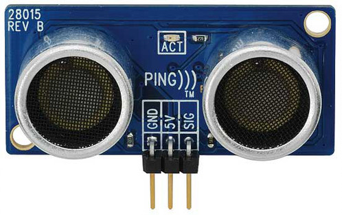
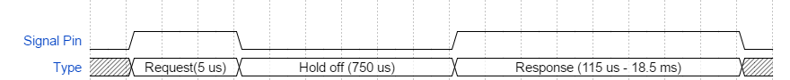
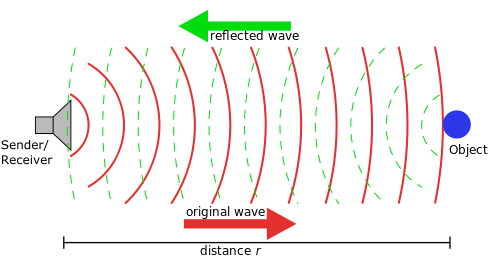
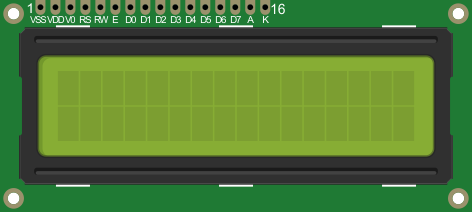
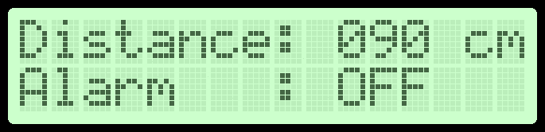
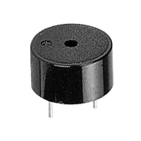

= Mini Project: Distance Sensor
Saleh AlSaleh, Hazem Selmi and Ahmad Khayyat 
212, 29 Dec 2021

== Objectives

- Using Timers to Measure Pulse Duration
- Using an ultrasonic sensor to measure distance
- Using character LCD displays
- Integrating multiple devices in a small project

== Parts List

- LPC1768 mbed board
- USB A-Type to Mini-B cable
- Breadboard
- Ping)))(TM) Ultrasonic Sensor
- 16x2 character LCD display
- Buzzer
- 5V Power Supply
- Jumper wires
- Breadboard

== Background

=== Ultrasonic Waves

Ultrasonic waves are sound waves transmitted above the human-detectable frequency range, usually above 20000 Hz. The term _sonic_ refers to the sound waves of high amplitudes. These waves can be used in medical diagnostics. They can also be used in the industrial to know the exact borehole where a hole needs to be dug to extract oil or natural gas. Even though humans cannot detect such waves, some animals can detect such as dogs or even use them such as bats. <<ultrasonic-waves>> 

=== Ultrasonic Sensors

Ultrasonic Sensors are special devices that transmits ultrasonic waves and receives the reflection of the waves after they hit a body. As shown above the sensor has two Ultrasonic Transducer (Receiver/Transmitter) to get a more accurate reading. Ping))) Ultrasonic sensor uses only a single pin to send and receive data unlike other sensors where they need two pins (one for requesting and one for receiving). This is very helpful because some microcontrollers have limited number of pins. This ultrasonic sensor can detect the distance as low as 2 centimeters and as high as 3 meters. The signal pin has two functrionality. The first functionality is _Trigger_ labeled Request in the diagram might also be refered to as _Start Pulse_. The microcontroller needs to send a _HIGH_ Signal for approximately 2-5 microseconds. Sending the _Start Pulse_ will make the ultrasonic sensor prepare to send ultrasonic wave. The preparation time is labeled _HOLD OFF_ which usually takes 750 microseconds. During the _HOLD OFF_ time, the signal pin is set _LOW_ by the ultrasonic sensor. Then, it needs to put to _LOW_. The other functionality is _Echo_ labeled as _Response_ where the ultrasonic sensor sends the time it took the ultrasoic waves to be transmitted and then received (after hitting a wall or something) by the sensor as pulse refered to as _Echo Time Pulse_. The _HIGH_ pulse determines the time and from time, we can get the distance. 

Please refer to the data sheet for more information.<<ping-ultrasonic-sensor>>

The image below shows how the ultrasonic waves propogates from the source to the object and reflect back to the source.

== Tasks 

=== Read the response time of the Echo Wave
Write a program that sends a request (_Start Pulse_) to the ultrasonic sensor and then reads the response (_Echo Pulse_) time given by the sensor using Timer Capture Pins. Refer back to Experiment #4: Hardware Timers for reviewing Timer Capture functionality. +

[TIP]

==================================================

. Use functions in your program to increase modularity.

. Use a global variable to store the response time to make it easier to have a minimal ISR:  +
`static double elapsedTime; // holds response (echo) time value`

==================================================

=== Calculating the distance from the response time

We learned from Physics that:

// [.text-center]
// stem:[Speed = (Distance)/(Time) ]

[.text-center]
latexmath:[\displaystyle Speed = \frac{\textrm{Distance}}{\textrm{Time}}]

Since the ultrasonic waves travel at the speed of sound, which is 340.29 m/s, calculate the distance corresponding to the response time received from the sensor. 

[TIP]

===================================================

. Remember that the response time is equal to the time it took the waves to propagates from the source, hit an object and then bounce back to the receiver (device).

. Use a global variable to store the distance value, similar to what you have done for the response time.

===================================================

=== Show the Distance on the LCD Display

The 16x2 character LCD display consists of two rows of characters, each of which contains 16 characters. These displays are widely used in embedded systems project to present information to the user of the system.

Show the distance calculated in the previous task in the first row, while showing the status of the alarm buzzer (more on this in the next task) in the second row as shown in the LCD Sample Output figure below. For information on how to use the LCD, refer to the LCD datasheet [lcd-16-2-datasheet]. 

=== Sound an Alarm Using a Buzzer Based on Distance

A buzzer is can generate sounds to alert the user. It’s widely used in alarm systems to alarm people for an emergency. One of the applications for ultrasonic sensors is knowing whether there’s an object at some predefined distance or not. Most modern cars have multiple ultrasonic sensors in the back at different angles to notify the driver if he gets very close to the car behind him, or if he is about to hit an object he could not see through the rear-view mirror.

Generate an alarm sound whenever the distance from the ultrasonic sensor to the object is 50 cm or less.

== Grading Sheet

[cols="5,1",options="header"]
|==================================================
| Task | Points

| Read the response time of the Echo wave | 4
| Calculate the distance from the response time | 1
| Display the distance on the LCD display | 4
| Sound the alarm using a buzzer based on distance | 1

|==================================================
[bibliography]
== References
* [[[ultrasonic-waves]]] 
+ 
Ultrasound: Definition And Application +
https://byjus.com/physics/applications-ultrasound/

* [[[ping-ultrasonic-sensor]]] 
+ 
Ping))) Ultrasonic Sensor Datasheet + 
https://www.robotshop.com/media/files/pdf/ping-documentation-v1-5-28015.pdf

* [[[lcd-16-2-datasheet]]]
+
Xiamen Amotec Display Co.,Ltd. 'Specifications of LCD Module. Module No: ADM1602K-NSW-FBS/3.3v'. Version 00, 2008-10-29. +
https://www.sparkfun.com/datasheets/LCD/ADM1602K-NSW-FBS-3.3v.pdf